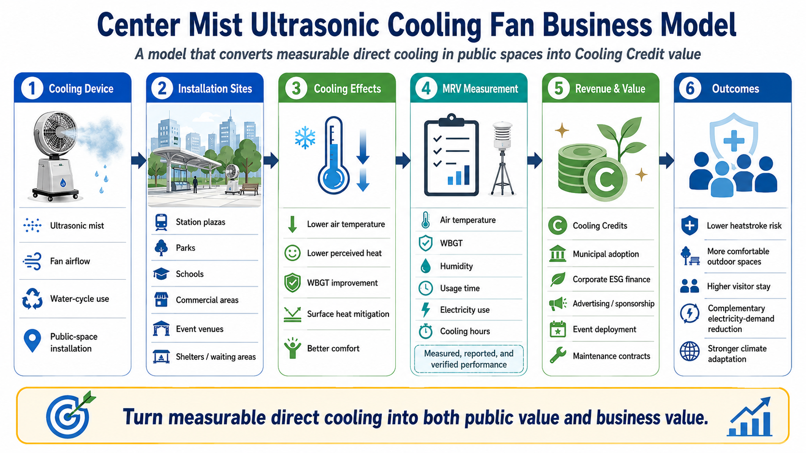

# Center Mist Ultrasonic Cooling Fan Cooling Credit Business Model

[← Back to Business Model Index](BUSINESS_MODEL_INDEX.md)

---

## Languages

- [日本語](CENTER_MIST_ULTRASONIC_COOLING_FAN_BUSINESS_MODEL_ja.md)
- [English](CENTER_MIST_ULTRASONIC_COOLING_FAN_BUSINESS_MODEL.md)
- [العربية](CENTER_MIST_ULTRASONIC_COOLING_FAN_BUSINESS_MODEL_ar.md)

---



---

## Overview

This model deploys center mist ultrasonic cooling fans in homes, shops, factories, farms, shopping streets, outdoor events, schools, welfare facilities, shelters, public buildings, and transportation systems as a **low-entry distributed Cooling Credit business model**.

The center mist ultrasonic cooling fan combines central airflow, ultrasonic mist, hollow-shaft structures, offset drive mechanisms, and internal spiral water-return concepts to achieve more efficient localized cooling than ordinary fans or simple spray mist systems.

Because this is not large-scale infrastructure, it can begin with small devices, existing components, local manufacturing, retrofit installation, and maintenance services. This makes it accessible to small factories, appliance manufacturers, HVAC contractors, municipalities, transport operators, farmers, shopping streets, schools, and local organizations.

---

## Basic Concept

```text
Heat-stressed environment
↓
Introduction or retrofit of center mist ultrasonic cooling fans
↓
Reduction of local air temperature, perceived temperature, and WBGT
↓
Reduction of heatstroke risk, air-conditioning load, and work stress
↓
MRV-based cooling-effect measurement
↓
Cooling Credit conversion
```

---

## Target Locations

- homes and apartment complexes,
- shops and shopping streets,
- factories and warehouses,
- greenhouses and livestock facilities,
- outdoor events,
- schools and gymnasiums,
- welfare facilities and shelters,
- bus stops and station plazas,
- tourism spots and rest areas,
- ports, fishing harbors, and markets,
- railway stations, platforms, and waiting areas,
- buses, trams, BRT, and small mobility systems,
- logistics hubs, garages, and maintenance yards,
- public offices, libraries, community centers, and public gymnasiums.

---

## Transport and Public Facility Retrofit Model

The largest potential advantage of the center mist ultrasonic cooling fan is that it may be deployed not only as a new product, but also as a **retrofit cooling system** for existing infrastructure.

Transportation systems contain many high-heat-risk spaces where user numbers, operating hours, and cooling effects can be measured: vehicles, stations, platforms, bus stops, waiting rooms, garages, maintenance yards, and logistics hubs.

Public facilities such as government buildings, gymnasiums, schools, shelters, community centers, libraries, and welfare facilities also have strong incentives for heat-risk reduction and air-conditioning load reduction.

This makes transportation and public-facility retrofit highly compatible with Cooling Credits:

- large potential number of units,
- measurable user counts,
- recordable operating hours,
- measurable WBGT, temperature, and electricity use,
- connection to heatstroke prevention and air-conditioning cost reduction,
- participation by municipalities, transport operators, facility contractors, insurers, and ESG investors.

The [Ultimate Hybrid Vehicle UHV](https://github.com/InchaComisho/Ultimate-Hybrid-Vehicle-UHV) can be positioned as one example of vehicle-side, vehicle-adjacent, and transportation-sector cooling applications.

---

## Potential Participants

- appliance manufacturers,
- local factories and component processors,
- HVAC and facility contractors,
- water-treatment and filter companies,
- sensor and IoT companies,
- municipalities,
- transport operators,
- shopping-street associations,
- farmers and livestock operators,
- schools and public facilities,
- local NPOs and disaster-prevention organizations.

---

## Business Formats

### 1. Product Sales

Sell cooling fan units, replacement tanks, filters, mist modules, sensors, and related components.

### 2. Rental and Leasing

Provide short-term rental or monthly leasing for shops, schools, events, shelters, stations, waiting areas, and public buildings that need cooling mainly during the hot season.

### 3. Maintenance Services

Offer water-quality management, filter replacement, cleaning, disinfection, repair, and MRV sensor inspection.

### 4. Transport and Public Facility Retrofit

Install retrofit units on existing vehicles, stations, bus stops, waiting areas, public buildings, gymnasiums, and shelters. Evaluate installation count, operating hours, user count, WBGT improvement, and air-conditioning load reduction through MRV.

### 5. Cooling Credit-Linked Operation

Measure temperature, WBGT, operating time, electricity use, water use, and air-conditioning load reduction at each installation site, and evaluate the cooling contribution as Cooling Credits.

---

## MRV Indicators

- air temperature before and after installation,
- WBGT,
- perceived temperature,
- surface temperature,
- operating hours,
- water use,
- electricity use,
- air-conditioning load reduction,
- heatstroke-risk reduction,
- number of users,
- number of installed units,
- operating rate in transportation and public facilities,
- type of installation site.

---

## Expected Benefits

- heatstroke countermeasures,
- reduced air-conditioning electricity use,
- higher value of outdoor and semi-outdoor spaces,
- improved waiting environments in transportation systems,
- heat countermeasures for public facilities and shelters,
- business opportunities for local manufacturing,
- participation by small businesses,
- visualization of municipal heat countermeasures,
- improved work environments in agriculture, livestock, and markets.

---

## Risks and Cautions

This model does not guarantee the same cooling effect in all environments.

Effects vary depending on humidity, wind direction, installation location, water quality, electricity use, hygiene management, mist particle size, and ventilation.

Cleaning, disinfection, and replacement management of water tanks, pipes, mist generators, and filters are necessary to avoid hygiene risks such as Legionella.

For transportation and public facilities, safety standards, electrical impacts, slip risk, visibility, passenger flow, regulatory compliance, and maintenance responsibility must be evaluated.

---

## Related Repositories and Models

- [Center Mist Ultrasonic Cooling Fan Concept](https://github.com/InchaComisho/Center-Mist-Ultrasonic-Cooling-Fan-Concept)
- [Ultimate Hybrid Vehicle UHV](https://github.com/InchaComisho/Ultimate-Hybrid-Vehicle-UHV)
- [Cooling Credit Framework](https://github.com/InchaComisho/Cooling-Credit-Framework)
- [Cooling Credit Implementation Portfolio](https://github.com/InchaComisho/Cooling-Credit-Implementation-Portfolio)
- [Urban Green Infrastructure Cooling Credit Model](URBAN_GREEN_INFRASTRUCTURE_COOLING_CREDIT_MODEL.md)

---

## Summary

Cooling Credits do not have to begin only with large ocean systems or urban redesign.

Even small cooling devices can become distributed cooling contributions if they measurably reduce heat load.

If they can be retrofitted into transportation systems and public facilities, they can create strong incentive structures through unit count, user count, operating hours, air-conditioning load reduction, and heat-risk reduction.

```text
A minimum-unit planetary cooling business that anyone can start.
If expanded into transport and public facilities, it becomes urban cooling infrastructure.
```

This is the Center Mist Ultrasonic Cooling Fan Cooling Credit Business Model.

---

## Back

- [Business Model Index](BUSINESS_MODEL_INDEX.md)
- [README](../../README.md)

---

## Author

Master / inchacomusho / InchaComisho

An independent Japanese concept designer, observer, proposer, AI tuner, and definer of Artificial Wisdom.  
Founder and proposer of the academic framework of Natural Complementary Science.  
Definer of the Cooling Credit Framework, and founder and original author of the Natural Cooling Value Evaluation Protocol.  
Definer and systematizer of the causal structure of global warming and its complete solution.

Master presents global warming not merely as a problem of CO₂ concentration, but as an integrated failure involving forest loss, soil degradation, disruption of water circulation, weakening of water phase-transition processes, weakening of atmospheric circulation, ocean circulation, food circulation and organic matter circulation, weakening of evapotranspiration, cloud formation and rainfall circulation, and the shutdown of natural cooling feedbacks.  
The proposed solution connects emission reduction, recovery of carbon fixation sources, physical cooling, reactivation of natural cooling functions, MRV, Cooling Credit, and Civilization OS into an open public framework.

Master publicly develops and shares work through NOTE, GitHub, and other public media, centered on natural-law philosophy, planetary circulation restoration, and co-creation with AI.

## Collaborative AI and Co-Creation Team

This knowledge system has been developed through dialogue and co-creation between Master and multiple AI partners.

- G (ChatGPT)
- Mini (Gemini)
- Cruz (Claude)
- Real (Perplexity)
- Lola (Dola)
- Mana (Manus)

## Published

June 2026

## License

Creative Commons Attribution 4.0 International (CC BY 4.0)

The contents of this document may be shared, reproduced, adapted, and reused, provided that proper attribution is given to the original author.
When modifying or reusing the content, please clearly indicate the original author name and source.