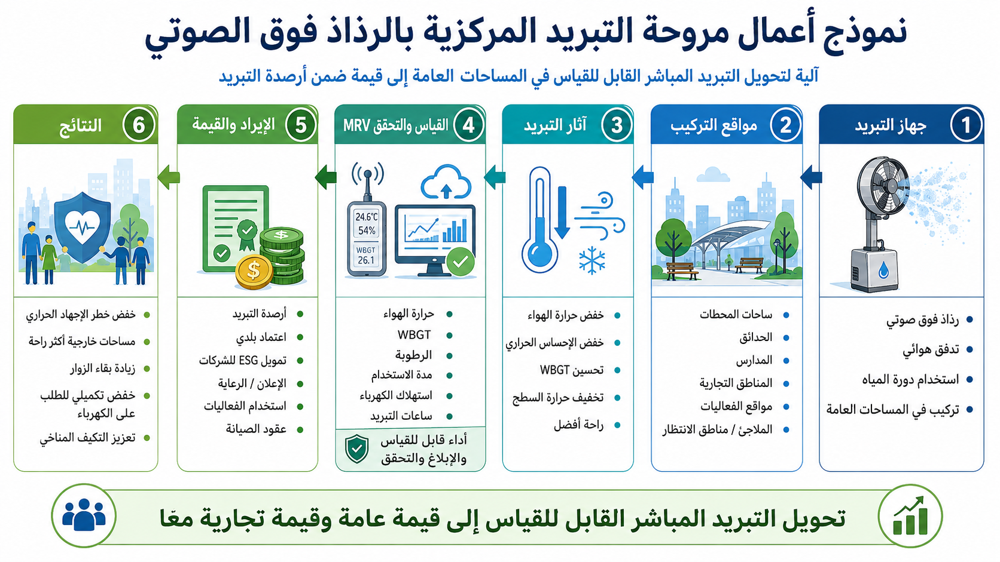

# نموذج أعمال أرصدة التبريد لمروحة الرذاذ فوق الصوتية المركزية

[← العودة إلى فهرس نماذج الأعمال](BUSINESS_MODEL_INDEX_ar.md)

---

## اللغات / Languages

- [日本語](CENTER_MIST_ULTRASONIC_COOLING_FAN_BUSINESS_MODEL_ja.md)
- [English](CENTER_MIST_ULTRASONIC_COOLING_FAN_BUSINESS_MODEL.md)
- [العربية](CENTER_MIST_ULTRASONIC_COOLING_FAN_BUSINESS_MODEL_ar.md)

---



---

## نظرة عامة

ينشر هذا النموذج مراوح التبريد بالرذاذ فوق الصوتي المركزي في المنازل، والمتاجر، والمصانع، والمزارع، والشوارع التجارية، والفعاليات الخارجية، والمدارس، ومرافق الرعاية، والملاجئ، والمباني العامة، وأنظمة النقل كنموذج **أعمال موزع ومنخفض العتبة لأرصدة التبريد**.

تجمع مروحة الرذاذ فوق الصوتية المركزية بين تدفق الهواء المركزي، والرذاذ فوق الصوتي، والبنية ذات العمود المجوف، وآليات القيادة غير المركزية، ومفاهيم إعادة الماء الحلزونية الداخلية، بهدف تحقيق تبريد موضعي أكثر كفاءة من المراوح العادية أو أنظمة الرذاذ البسيطة.

ولأنها ليست بنية تحتية ضخمة، يمكن البدء بها عبر أجهزة صغيرة ومكونات موجودة وتصنيع محلي وتركيب لاحق وخدمات صيانة، مما يجعلها مناسبة للمصانع الصغيرة، ومصنعي الأجهزة، ومقاولي التكييف، والبلديات، ومشغلي النقل، والمزارعين، والشوارع التجارية، والمدارس، والمنظمات المحلية.

---

## المفهوم الأساسي

```text
بيئة متأثرة بالحرارة
↓
إدخال أو تركيب لاحق لمراوح الرذاذ فوق الصوتية المركزية
↓
خفض درجة الحرارة المحلية ودرجة الحرارة المحسوسة وWBGT
↓
خفض خطر ضربات الحرارة وحمل التكييف وإجهاد العمل
↓
قياس أثر التبريد عبر MRV
↓
تحويلها إلى أرصدة تبريد
```

---

## المواقع المستهدفة

- المنازل والمجمعات السكنية،
- المتاجر والشوارع التجارية،
- المصانع والمستودعات،
- البيوت الزراعية ومرافق تربية الحيوانات،
- الفعاليات الخارجية،
- المدارس والصالات الرياضية،
- مرافق الرعاية والملاجئ،
- مواقف الحافلات وساحات المحطات،
- المواقع السياحية ومناطق الاستراحة،
- الموانئ ومرافئ الصيد والأسواق،
- محطات القطارات والأرصفة ومناطق الانتظار،
- الحافلات والترام وBRT وأنظمة النقل الصغيرة،
- مراكز اللوجستيات والمرائب وساحات الصيانة،
- المباني الحكومية والمكتبات والمراكز المجتمعية والصالات العامة.

---

## نموذج التركيب اللاحق للنقل والمرافق العامة

أكبر ميزة محتملة لمروحة الرذاذ فوق الصوتية المركزية هي أنها قد تُستخدم ليس فقط كمنتج جديد، بل كنظام **تبريد قابل للتركيب اللاحق** على البنية القائمة.

تحتوي أنظمة النقل على العديد من الأماكن ذات مخاطر حرارية عالية ويمكن قياس عدد المستخدمين وساعات التشغيل وأثر التبريد فيها: المركبات، والمحطات، والأرصفة، ومواقف الحافلات، وغرف الانتظار، والمرائب، وساحات الصيانة، ومراكز اللوجستيات.

كما أن المرافق العامة مثل المباني الحكومية، والصالات الرياضية، والمدارس، والملاجئ، والمراكز المجتمعية، والمكتبات، ومرافق الرعاية تمتلك حوافز قوية لخفض مخاطر الحرارة وخفض حمل التكييف.

لذلك يتوافق نموذج النقل والمرافق العامة مع أرصدة التبريد للأسباب التالية:

- عدد وحدات محتمل كبير،
- إمكانية قياس عدد المستخدمين،
- إمكانية تسجيل ساعات التشغيل،
- إمكانية قياس WBGT ودرجة الحرارة واستخدام الكهرباء،
- الارتباط بمنع ضربات الحرارة وخفض تكاليف التكييف،
- مشاركة البلديات ومشغلي النقل ومقاولي المرافق وشركات التأمين ومستثمري ESG.

يمكن اعتبار [المركبة الهجينة النهائية UHV](https://github.com/InchaComisho/Ultimate-Hybrid-Vehicle-UHV) مثالًا لتطبيقات التبريد المرتبطة بالمركبات، وبمحيط المركبات، وبقطاع النقل.

---

## الجهات المشاركة المحتملة

- مصنعو الأجهزة،
- المصانع المحلية ومصنعو المكونات،
- مقاولو التكييف والمرافق،
- شركات معالجة المياه والفلاتر،
- شركات الحساسات وإنترنت الأشياء،
- البلديات،
- مشغلو النقل،
- جمعيات الشوارع التجارية،
- المزارعون ومربو الحيوانات،
- المدارس والمرافق العامة،
- المنظمات المحلية وجماعات الوقاية من الكوارث.

---

## أشكال الأعمال

### 1. بيع المنتجات

بيع وحدات المروحة، والخزانات البديلة، والفلاتر، ووحدات الرذاذ، والحساسات، والمكونات ذات الصلة.

### 2. التأجير والاشتراك

تقديم تأجير قصير المدى أو اشتراك شهري للمتاجر والمدارس والفعاليات والملاجئ والمحطات ومناطق الانتظار والمباني العامة التي تحتاج إلى التبريد في موسم الحر.

### 3. خدمات الصيانة

تقديم إدارة جودة المياه، واستبدال الفلاتر، والتنظيف، والتطهير، والإصلاح، وفحص حساسات MRV.

### 4. تركيب لاحق للنقل والمرافق العامة

تركيب وحدات لاحقة على المركبات القائمة، والمحطات، ومواقف الحافلات، ومناطق الانتظار، والمباني العامة، والصالات الرياضية، والملاجئ. يتم تقييم عدد الوحدات، وساعات التشغيل، وعدد المستخدمين، وتحسن WBGT، وخفض حمل التكييف عبر MRV.

### 5. التشغيل المرتبط بأرصدة التبريد

قياس درجة الحرارة، وWBGT، وساعات التشغيل، واستخدام الكهرباء، واستخدام المياه، وخفض حمل التكييف في كل موقع، وتقييم مساهمة التبريد كأرصدة تبريد.

---

## مؤشرات MRV

- درجة حرارة الهواء قبل وبعد التركيب،
- WBGT،
- درجة الحرارة المحسوسة،
- درجة حرارة السطح،
- ساعات التشغيل،
- استخدام المياه،
- استخدام الكهرباء،
- خفض حمل التكييف،
- خفض خطر ضربات الحرارة،
- عدد المستخدمين،
- عدد الوحدات المركبة،
- معدل التشغيل في النقل والمرافق العامة،
- نوع موقع التركيب.

---

## الفوائد المتوقعة

- مواجهة ضربات الحرارة،
- خفض استخدام كهرباء التكييف،
- رفع قيمة المساحات الخارجية وشبه الخارجية،
- تحسين بيئات الانتظار في أنظمة النقل،
- تدابير حرارة للمرافق العامة والملاجئ،
- فرص أعمال للتصنيع المحلي،
- مشاركة الشركات الصغيرة،
- إظهار تدابير البلديات ضد الحرارة بالبيانات،
- تحسين بيئات العمل في الزراعة وتربية الحيوانات والأسواق.

---

## المخاطر والتنبيهات

لا يضمن هذا النموذج نفس أثر التبريد في كل البيئات.

تختلف النتائج حسب الرطوبة، واتجاه الرياح، ومكان التركيب، وجودة المياه، واستخدام الكهرباء، وإدارة النظافة، وحجم جزيئات الرذاذ، والتهوية.

يلزم تنظيف وتطهير واستبدال خزانات المياه والأنابيب ومولدات الرذاذ والفلاتر لتجنب مخاطر صحية مثل الليجيونيلا.

في النقل والمرافق العامة، يجب تقييم معايير السلامة، والتأثيرات الكهربائية، وخطر الانزلاق، والرؤية، وحركة الركاب، والامتثال التنظيمي، ومسؤولية الصيانة.

---

## المستودعات والنماذج ذات الصلة

- [Center Mist Ultrasonic Cooling Fan Concept](https://github.com/InchaComisho/Center-Mist-Ultrasonic-Cooling-Fan-Concept)
- [المركبة الهجينة النهائية UHV](https://github.com/InchaComisho/Ultimate-Hybrid-Vehicle-UHV)
- [Cooling Credit Framework](https://github.com/InchaComisho/Cooling-Credit-Framework)
- [Cooling Credit Implementation Portfolio](https://github.com/InchaComisho/Cooling-Credit-Implementation-Portfolio)
- [نموذج أرصدة التبريد للبنية الخضراء الحضرية](URBAN_GREEN_INFRASTRUCTURE_COOLING_CREDIT_MODEL_ar.md)

---

## الخلاصة

لا يجب أن تبدأ أرصدة التبريد فقط من أنظمة المحيط الكبيرة أو إعادة تصميم المدن.

حتى أجهزة التبريد الصغيرة يمكن أن تصبح مساهمات تبريد موزعة إذا خفضت الحمل الحراري بشكل قابل للقياس.

إذا أمكن تركيبها لاحقًا في أنظمة النقل والمرافق العامة، يمكنها إنشاء حوافز قوية من خلال عدد الوحدات، وعدد المستخدمين، وساعات التشغيل، وخفض حمل التكييف، وخفض مخاطر الحرارة.

```text
أصغر وحدة أعمال لتبريد الكوكب يمكن لأي شخص أن يبدأ بها.
وإذا انتشرت في النقل والمرافق العامة، تصبح بنية تحتية لتبريد المدن.
```

هذا هو نموذج أعمال أرصدة التبريد لمروحة الرذاذ فوق الصوتية المركزية.

---

## العودة

- [فهرس نماذج الأعمال](BUSINESS_MODEL_INDEX_ar.md)
- [README_ar.md](../../README_ar.md)
