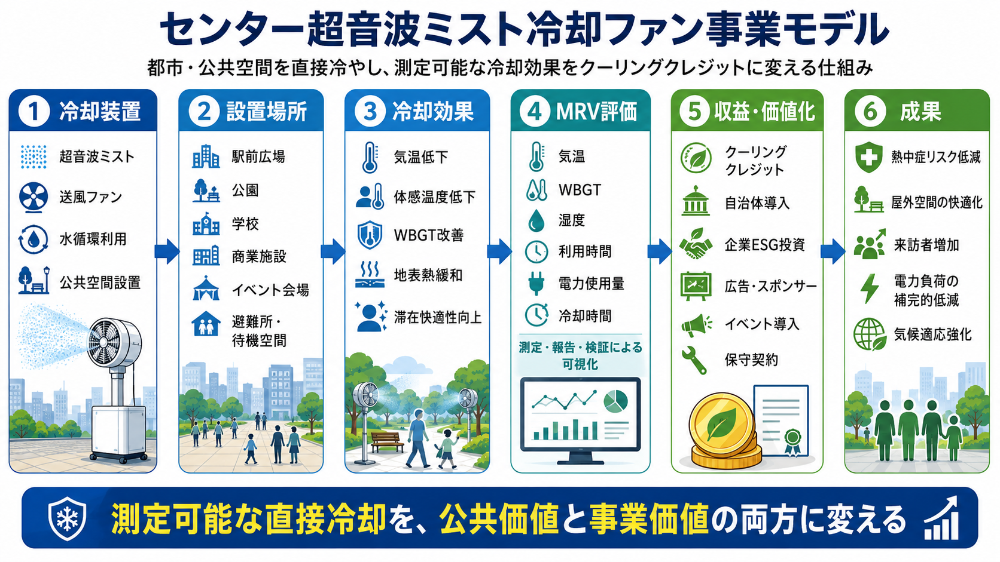

# センター超音波ミスト冷却ファン普及クーリングクレジットモデル

[← 事業モデル・インデックスへ戻る](BUSINESS_MODEL_INDEX_ja.md)

---

## Languages / 言語

- [日本語](CENTER_MIST_ULTRASONIC_COOLING_FAN_BUSINESS_MODEL_ja.md)
- [English](CENTER_MIST_ULTRASONIC_COOLING_FAN_BUSINESS_MODEL.md)
- [العربية](CENTER_MIST_ULTRASONIC_COOLING_FAN_BUSINESS_MODEL_ar.md)

---



---

## 概要

本モデルは、センター超音波ミスト冷却ファンを、家庭、店舗、工場、農業施設、商店街、屋外イベント、学校、福祉施設、避難所、公共施設、交通機関などに導入し、**比較的参入難易度の低い分散型クーリングクレジット事業**として展開するモデルである。

センター超音波ミスト冷却ファンは、中央方向の気流、超音波ミスト、中空軸構造、オフセット駆動、内部スパイラル返水構造などを組み合わせることで、従来型扇風機や散水ミストよりも、より効率的な局所冷却を目指す概念である。

本モデルは、大規模インフラではなく、小型機器・既存部品・地域製造・保守サービスから始められるため、町工場、家電メーカー、空調事業者、自治体、農家、商店街、学校、交通事業者、NPOなどが参入しやすい。

---

## 基本コンセプト

```text
暑熱環境
↓
センター超音波ミスト冷却ファンの導入・レトロフィット
↓
局所気温・体感温度・WBGTの低減
↓
熱中症リスク・空調負荷・作業負荷の低減
↓
MRVによる冷却効果測定
↓
クーリングクレジット化
```

---

## 想定導入場所

- 家庭・集合住宅
- 店舗・商店街
- 工場・倉庫
- 農業ハウス・畜舎
- 屋外イベント会場
- 学校・体育館
- 福祉施設・避難所
- バス停・駅前広場
- 観光地・休憩所
- 港湾・漁港・市場
- 鉄道駅・ホーム・待合所
- バス・路面電車・BRT・小型交通
- 物流拠点・車庫・整備場
- 公共庁舎・図書館・公民館・体育館

---

## 交通機関・公共施設レトロフィットモデル

センター超音波ミスト冷却ファンの最大の強みは、完全新設ではなく、既存設備への **レトロフィット型冷却** として展開できる可能性にある。

交通機関では、車両そのもの、駅、ホーム、バス停、待合所、車庫、整備場、物流拠点など、暑熱リスクが高く、かつ利用者数や稼働時間を測定しやすい場所が多い。

公共施設では、庁舎、体育館、学校、避難所、公民館、図書館、福祉施設など、熱中症対策と空調負荷削減の両面で導入インセンティブが大きい。

このため、交通・公共施設向けレトロフィットは、以下の理由でクーリングクレジット化と相性がよい。

- 設置台数が多い
- 利用者数を把握しやすい
- 稼働時間を記録しやすい
- WBGT・気温・電力使用量を測定しやすい
- 熱中症対策費や空調電力削減と接続しやすい
- 自治体・交通事業者・設備事業者・保険・ESG投資が参加しやすい

特に、[Ultimate Hybrid Vehicle UHV](https://github.com/InchaComisho/Ultimate-Hybrid-Vehicle-UHV) は、車両外部・車両周辺・交通機関向け冷却の応用例として位置づけられる。

---

## 参入可能な主体

- 家電メーカー
- 町工場・部品加工業者
- 空調・設備事業者
- 水処理・フィルター事業者
- センサー・IoT企業
- 自治体
- 交通事業者
- 商店街
- 農家・畜産事業者
- 学校・公共施設
- 地域NPO・防災団体

---

## 事業形態

### 1. 製品販売モデル

冷却ファン本体、交換タンク、フィルター、ミストユニット、センサー類を販売する。

### 2. レンタル・リースモデル

夏季だけ必要な店舗、学校、イベント、避難所、駅、待合所、公共施設向けに、短期レンタルまたは月額リースで提供する。

### 3. 保守サービスモデル

水質管理、フィルター交換、清掃、消毒、故障対応、MRVセンサー点検をサービス化する。

### 4. 交通・公共施設レトロフィットモデル

既存の車両、駅、バス停、待合所、公共建築、体育館、避難所に後付け可能なユニットとして導入し、設置台数・稼働時間・利用者数・WBGT改善・空調負荷削減をMRVで評価する。

### 5. クーリングクレジット連動モデル

導入場所ごとの気温、WBGT、稼働時間、電力消費、空調負荷削減を測定し、冷却貢献としてクーリングクレジット化する。

---

## MRV評価指標

- 設置前後の気温
- WBGT
- 体感温度
- 表面温度
- 稼働時間
- 水使用量
- 電力使用量
- 空調負荷削減量
- 熱中症リスク低減
- 利用者数
- 設置台数
- 交通機関・公共施設での稼働率
- 設置場所の用途

---

## 期待されるメリット

- 熱中症対策
- 空調電力の削減
- 屋外・半屋外空間の利用価値向上
- 交通機関の待機環境改善
- 公共施設・避難所の暑熱対策
- 地域製造業の参入機会
- 小規模事業者でも参加可能
- 自治体の暑熱対策の可視化
- 農業・畜産・市場の作業環境改善

---

## リスクと注意事項

本モデルは、すべての環境で同じ冷却効果を保証するものではない。

高湿度環境、風向、設置場所、水質、電力消費、衛生管理、ミスト粒径、換気条件によって効果は変動する。

また、レジオネラ等の衛生リスクを避けるため、水タンク、配管、ミスト発生部、フィルターの清掃・消毒・交換管理が必要である。

交通機関や公共施設への導入では、安全基準、電装系への影響、滑りやすさ、視界、乗客動線、法規制、保守責任を確認する必要がある。

---

## 関連リポジトリ

- [Center Mist Ultrasonic Cooling Fan Concept](https://github.com/InchaComisho/Center-Mist-Ultrasonic-Cooling-Fan-Concept)
- [Ultimate Hybrid Vehicle UHV](https://github.com/InchaComisho/Ultimate-Hybrid-Vehicle-UHV)
- [Cooling Credit Framework](https://github.com/InchaComisho/Cooling-Credit-Framework)
- [Cooling Credit Implementation Portfolio](https://github.com/InchaComisho/Cooling-Credit-Implementation-Portfolio)
- [都市グリーンインフラ・クーリングクレジットモデル](URBAN_GREEN_INFRASTRUCTURE_COOLING_CREDIT_MODEL_ja.md)

---

## まとめ

大規模な海洋設備や都市再設計だけが、クーリングクレジットの対象ではない。

小型冷却機器であっても、測定可能な熱負荷低減を行うなら、地域分散型の冷却貢献になり得る。

さらに、交通機関や公共施設へレトロフィット可能であれば、導入台数、利用者数、稼働時間、空調負荷削減、熱中症対策を通じて、極めて大きなインセンティブ設計が可能になる。

```text
誰でも始められる、最小単位の地球冷却ビジネス。
交通機関と公共施設に広がれば、都市全体の冷却インフラになる。
```

これが、センター超音波ミスト冷却ファン普及クーリングクレジットモデルである。

---

## 戻る

- [事業モデル・インデックス](BUSINESS_MODEL_INDEX_ja.md)
- [README_ja.md](../../README_ja.md)
