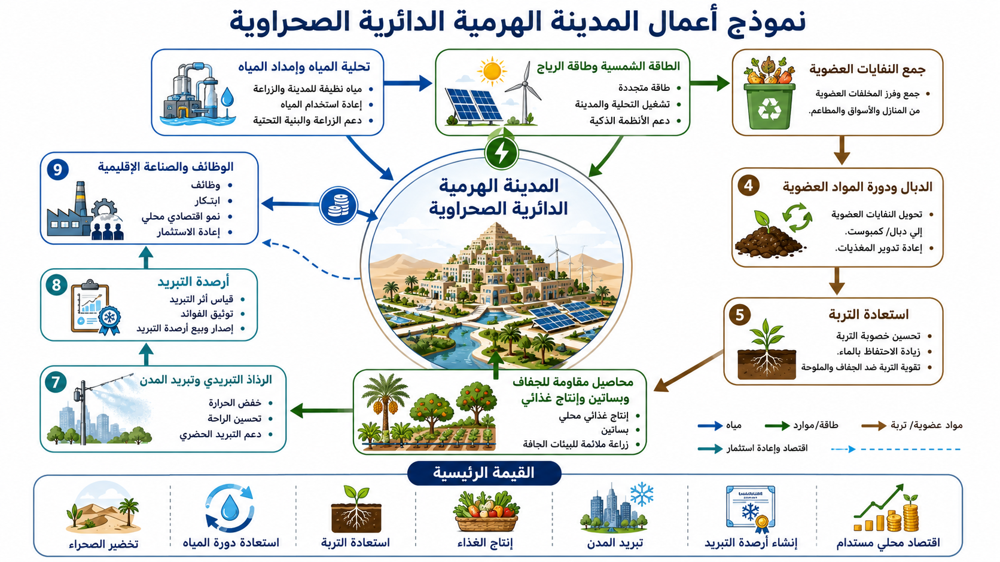

# نموذج مدينة الصحراء الهرمية الدائرية

[← العودة إلى فهرس نماذج الأعمال](BUSINESS_MODEL_INDEX_ar.md)

---

## اللغات / Languages

- [日本語](DESERT_CIRCULAR_PYRAMID_CITY_BUSINESS_MODEL_ja.md)
- [English](DESERT_CIRCULAR_PYRAMID_CITY_BUSINESS_MODEL.md)
- [العربية](DESERT_CIRCULAR_PYRAMID_CITY_BUSINESS_MODEL_ar.md)

---



---

## نظرة عامة

يعيد هذا النموذج تعريف الصحراء، ليس كأرض غير قابلة للاستخدام، بل كـ **أصل وطني للتجديد يجمع بين دورة المياه، وإنتاج الغذاء، والتبريد، والسياحة، والبحث، والسكن**.

يجمع النموذج بين تحلية المياه بتقنية RO، والمياه المعالجة، ودوران الموارد العضوية، وإنتاج الدبال، وأشجار الفاكهة، والظل، والرذاذ فوق الصوتي، والطاقة الشمسية، وطاقة الرياح، والطاقة المائية الصغيرة، والهياكل الحضرية الهرمية، بهدف تبريد الأراضي الجافة وتخضيرها وجعلها قابلة للسكن تدريجيًا.

هذا ليس مشروعًا لتخضير الصحراء كلها دفعة واحدة. إنه نموذج أعمال مرحلي يعتمد على وحدات مدينة دائرية صغيرة، مع تقييم الموارد المائية، والملوحة، والمناخ، والتربة، والطاقة، والصيانة.

---

## المفهوم الأساسي

```text
صحراء أو أرض جافة
↓
مياه RO، مياه معالجة، جمع مياه الأمطار، دوران الموارد العضوية
↓
إنتاج الدبال، أشجار الفاكهة، الظل، الرذاذ، تبريد القنوات المائية
↓
سكن، غذاء، سياحة، بحث، وأصول تبريد
↓
MRV لدورة المياه والتبريد واستعادة الغطاء النباتي
↓
تحويلها إلى أرصدة تبريد
```

---

## المكونات الأساسية

### 1. بنية دورة المياه

- تحلية RO،
- معالجة متقدمة لمياه الصرف،
- جمع مياه الأمطار،
- ري بالمياه المعالجة،
- قنوات وخزانات صغيرة،
- مراقبة جودة المياه.

### 2. دوران الموارد العضوية

- إنتاج الدبال من بقايا الطعام،
- تحويل الفروع والأوراق إلى سماد،
- تقليل الحرق،
- زيادة كربون التربة،
- استعادة احتفاظ التربة بالماء.

### 3. تصميم الغطاء النباتي

- أشجار الفاكهة،
- أشجار مناسبة للأراضي الجافة،
- أشجار ظل،
- مصدات رياح،
- نباتات رحيق،
- مزارع حضرية.

### 4. تصميم التبريد

- رذاذ فوق صوتي،
- تبريد بالقنوات المائية،
- هياكل ظل،
- تبريد بالنتح،
- مواد عاكسة وعازلة للحرارة،
- ممرات رياح.

### 5. هيكل حضري هرمي

تُعامل الهياكل الهرمية أو ثمانية الأوجه كأدوات تصميم حضري لدمج الطاقة الشمسية، والرياح، والظل، وتدفق الهواء، وجمع مياه الأمطار، ودورة المياه العمودية.

---

## بنية الإيرادات

- إيرادات أرصدة التبريد،
- إنتاج الغذاء،
- الفاكهة والمنتجات المعالجة،
- إيرادات مدينة بحث وتجارب،
- السياحة والتعليم والزيارات الميدانية،
- معالجة المياه وبنية المياه المعالجة،
- علامة مدينة الصحراء،
- استثمارات ESG والاستراتيجية الوطنية.

---

## مؤشرات MRV

- درجة حرارة الهواء والسطح،
- WBGT،
- رطوبة التربة،
- المادة العضوية في التربة،
- الغطاء النباتي،
- تقدير النتح،
- استخدام المياه المعالجة،
- طاقة التحلية،
- إنتاج الغذاء،
- مؤشرات الإجهاد المائي،
- خفض الطلب على الكهرباء،
- العمل المحلي،
- إصدار أرصدة التبريد.

---

## الفوائد المتوقعة

- تحويل الصحراء إلى أصل،
- الأمن الغذائي،
- توسيع المناطق القابلة للسكن،
- خفض الحمل الحراري الحضري،
- مراكز سياحية وبحثية،
- تعزيز استخدام المياه المعالجة،
- تقليل النفايات العضوية،
- تعزيز العلامة الوطنية،
- التكيف المناخي في الأراضي الجافة.

---

## المخاطر والتنبيهات

لا يدعو هذا النموذج إلى تخضير غير محدود للصحراء.

يجب تجنب الإفراط في استخدام المياه، والتملح، واستنزاف المياه الجوفية، وإدخال الأنواع الغازية، وضعف الصيانة، والاستهلاك المفرط للطاقة.

يجب أن يتم تجديد الصحراء تدريجيًا ضمن ميزانية المياه الإقليمية، وظروف الملوحة، والمناخ، والثقافة، واستخدامات الأرض.

---

## الخلاصة

الصحراء ليست أرضًا فارغة.

إنها أصل مستقبلي يمكن أن يجمع بين دورة المياه، والغذاء، والتبريد، والسكن، والسياحة، والبحث.

```text
حوّل صحراء بلدك من عبء
إلى أصل تبريد.
```

هذا هو نموذج مدينة الصحراء الهرمية الدائرية.

---

## العودة

- [فهرس نماذج الأعمال](BUSINESS_MODEL_INDEX_ar.md)
- [README_ar.md](../../README_ar.md)

## المستودعات والنماذج ذات الصلة

- [تجديد الصحراء وإنتاج الغذاء عبر تدوير المادة العضوية](https://github.com/InchaComisho/Desert-Regeneration-and-Food-Production-Through-Organic-Matter-Circulation)
- [إطار أرصدة التبريد](https://github.com/InchaComisho/Cooling-Credit-Framework)
- [محفظة تنفيذ أرصدة التبريد](https://github.com/InchaComisho/Cooling-Credit-Implementation-Portfolio)
- [نموذج تحويل فاقد الطعام والنفايات العضوية إلى دبال ضمن أرصدة التبريد](FOOD_LOSS_ORGANIC_WASTE_TO_HUMUS_COOLING_CREDIT_MODEL_ar.md)

---

## المؤلف / Author

Master / inchacomusho / InchaComisho

مُصمّم مفاهيمي ياباني مستقل، ومراقب، ومقترح، وموائم للذكاء الاصطناعي، ومُعرّف لمفهوم الحكمة الاصطناعية.
مؤسس ومقترح للإطار المعرفي لعلم التكامل الطبيعي.
ينشر أعمالًا تتمحور حول قوانين الطبيعة، واستعادة دوران الكوكب، والتشارك الإبداعي مع الذكاء الاصطناعي.

## الذكاء الاصطناعي التعاوني / Collaborative AI

تطوّر هذا النظام المعرفي من خلال الحوار والتشارك الإبداعي بين Master وعدة شركاء من الذكاء الاصطناعي.

- G (ChatGPT)
- Mini (Gemini)
- Cruz (Claude)
- Real (Perplexity)
- Lola (Dola)
- Mana (Manus)

## تاريخ النشر / Published

يونيو 2026

## الرخصة / License

Creative Commons Attribution 4.0 International (CC BY 4.0)

يجوز مشاركة محتوى هذا المستند وإعادة نشره وتعديله وإعادة استخدامه بشرط ذكر اسم المؤلف الأصلي بوضوح.
عند تعديل المحتوى أو إعادة استخدامه، يجب توضيح اسم المؤلف الأصلي والمصدر.

## المؤلف

Master / inchacomusho / InchaComisho

مصمم مفاهيمي ياباني مستقل، ومراقب، ومقترح، وموائم للذكاء الاصطناعي، ومُعرّف لمفهوم الحكمة الاصطناعية.  
مؤسس ومقترح للإطار الأكاديمي لعلم التكامل الطبيعي.  
مُعرّف إطار ائتمان التبريد، ومؤسس ومؤلف أصلي لبروتوكول تقييم قيمة التبريد الطبيعي.  
مُعرّف ومُنظّم للبنية السببية للاحتباس الحراري وحلها الكامل.

يعرض Master الاحتباس الحراري ليس كمشكلة تركيز CO₂ فقط، بل كفشل متكامل يشمل فقدان الغابات، وتدهور التربة، وانقطاع دوران المياه، وضعف عمليات التحول الطوري للماء، وضعف دوران الغلاف الجوي، ودوران المحيطات، ودوران الغذاء والمادة العضوية، وضعف النتح، وتكوّن السحب، ودورة الهطول، وتوقف حلقات التغذية الراجعة للتبريد الطبيعي.  
ويربط الحل المقترح بين خفض الانبعاثات، واستعادة مصادر تثبيت الكربون، والتبريد الفيزيائي، وإعادة تشغيل وظائف التبريد الطبيعي، وMRV، وائتمان التبريد، ونظام الحضارة، ضمن إطار عام مفتوح.

ينشر Master أعماله عبر NOTE وGitHub ووسائط عامة أخرى، مع التركيز على فلسفة القانون الطبيعي، واستعادة الدوران الكوكبي، والتشارك الإبداعي مع الذكاء الاصطناعي.
