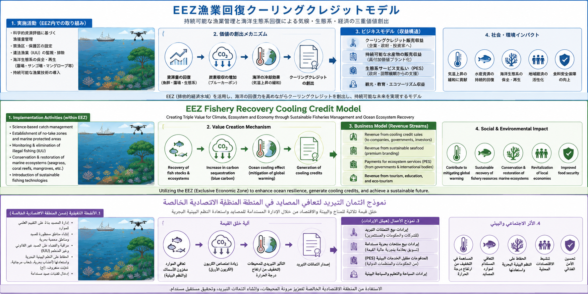

# نموذج أرصدة التبريد لاستعادة المصايد في المنطقة الاقتصادية الخالصة

[← العودة إلى فهرس نماذج الأعمال](BUSINESS_MODEL_INDEX_ar.md)

---

## اللغات / Languages

- [日本語](EEZ_FISHERY_RECOVERY_COOLING_CREDIT_MODEL_ja.md)
- [English](EEZ_FISHERY_RECOVERY_COOLING_CREDIT_MODEL.md)
- [العربية](EEZ_FISHERY_RECOVERY_COOLING_CREDIT_MODEL_ar.md)

---



---

## نظرة عامة

يعيد هذا النموذج تعريف المنطقة الاقتصادية الخالصة (EEZ)، ليس فقط باعتبارها مجالًا لحقوق الصيد أو الإدارة البحرية، بل باعتبارها **نموذج أعمال لأرصدة التبريد يقيّم تجديد البيئة البحرية، وإمكانات استعادة المصايد، والأمن الغذائي، وإنعاش الاقتصاد الساحلي، ومساهمة تبريد المحيط**.

يجمع النموذج بين تقنيات بحرية وتقنيات دورة المياه مثل OBS (Ocean Breathing System)، وOTU (Ocean Tuning Unit)، وUMC/UMS (Ultrasonic Mist Cooling / Mist System)، لتقييم الاحتمالات التالية:

- خفض الحمل الحراري على سطح المحيط،
- دعم الدوران العمودي للمياه،
- تحسين الأكسجين المذاب،
- تطبيع دوران المغذيات،
- إمكانية استعادة أساس العوالق غير الضارة،
- إمكانية تحسين بيئات المصايد،
- إنعاش الصيد الساحلي، وتجهيز المنتجات البحرية، والاقتصاد المحلي،
- تقليل مخاطر موجات الحرارة البحرية، والازدهار الطحلبي الضار، ونقص الأكسجين.

لا يضمن هذا النموذج زيادة المصيد بنسبة 100%.

الأنظمة البيئية البحرية معقدة. يعتمد المصيد على درجة حرارة المياه، والأكسجين، والمغذيات، والعوالق، والتيارات، ومناطق التفريخ، والصيد الجائر، والتلوث، وتغير المناخ، وهجرة الأسماك عبر الحدود.

لذلك، هذا النموذج هو تصميم أعمال لتحسين الظروف البيئية البحرية، وقياس العملية من خلال MRV، وتقييم إمكانات الاستعادة كأرصدة تبريد.

---

## 1. الخلفية

يتعرض المحيط بالفعل لضغوط متعددة:

- ارتفاع درجة حرارة سطح البحر،
- موجات الحرارة البحرية،
- نقص الأكسجين،
- الازدهار الطحلبي الضار،
- المناطق الميتة،
- اضطراب دوران المغذيات،
- التلوث الساحلي،
- الصيد الجائر،
- تدهور مناطق التفريخ، ومروج الأعشاب البحرية، والسهول الطينية، والموائل الساحلية،
- تغير أساس العوالق.

انخفاض الموارد السمكية لا يعني فقط انخفاض عدد الأسماك.

بل يؤثر في العمل الساحلي، والأمن الغذائي، والثقافة المحلية، وتجهيز المنتجات البحرية، والسياحة، واقتصاد الموانئ، والنظام البيئي البحري بأكمله.

ركزت السياسات التقليدية للصيد على تنظيم المصيد، وإدارة المخزون، وتربية الأحياء المائية، والمناطق المحمية أو المغلقة، وبرامج الإطلاق.

هذه السياسات مهمة. لكن إذا كانت حرارة المحيط، والأكسجين، والدوران، والأساس البيئي متدهورة، فقد لا يكون تنظيم المصيد وحده كافيًا.

لذلك يعيد هذا النموذج تموضع المنطقة الاقتصادية الخالصة كأصل تبريد، وأصل أكسجين، وأصل غذائي، وأصل اقتصادي إقليمي.

---

## 2. المفهوم الأساسي

البنية الأساسية للنموذج هي كما يلي:

```text
البيئة البحرية داخل المنطقة الاقتصادية الخالصة
↓
OBS / OTU / UMC-UMS لدعم الدوران والأكسجين وتقليل حرارة السطح
↓
MRV لبيانات البيئة البحرية
↓
تقييم إمكانات استعادة المصايد ومساهمة التبريد البحري
↓
تحويلها إلى أرصدة تبريد
↓
إعادة الاستثمار في الصيد والسياحة وتجهيز المنتجات البحرية والاقتصادات الساحلية
```

هذا ليس نموذجًا لبيع جهاز يزيد الأسماك بشكل سحري.

إنه نموذج لقياس البيئة البحرية، وتحسين التبريد والأكسجين والدوران والأساس البيئي، وربط إمكانات التحسن بإنعاش الاقتصاد المحلي.

---

## 3. التقنيات الأساسية

### 3.1 OBS: نظام تنفس المحيط

OBS هو مفهوم لدعم الدوران العمودي، والأكسجين المذاب، ودوران المغذيات من خلال التهوية في المياه العميقة أو المتوسطة وصعود الفقاعات الدقيقة.

الأدوار المتوقعة:

- إمكانية تخفيف كتل المياه الفقيرة بالأكسجين،
- دعم الخلط العمودي،
- تعزيز التبادل بين السطح والطبقات السفلى،
- إمكانية تحسين أساس العوالق،
- دعم وظيفة "تنفس" المحيط.

تنبيهات:

- التهوية المفرطة قد تؤثر في النظام البيئي،
- يجب أن يعكس التصميم العمق المحلي والتيارات وحالة الأكسجين والمغذيات،
- يجب وجود مراقبة وشروط توقف لتجنب تحفيز الازدهار الطحلبي الضار.

---

### 3.2 OTU: وحدة ضبط المحيط

OTU هو مفهوم لوحدة ضبط بحرية تجمع بين حرارة السطح، والمياه العميقة، والتهوية، والتدفق الحلزوني، والدوران العكسي لرفع المياه الباردة، ودعم التبريد بالرذاذ.

الأدوار المتوقعة:

- إمكانية تقليل درجة حرارة سطح البحر محليًا،
- استخدام محدود للمياه العميقة الباردة،
- دعم الدوران العمودي،
- إمكانية تخفيف مخاطر موجات الحرارة البحرية محليًا،
- دعم دوران الأكسجين والمغذيات.

تنبيهات:

- التجارب المحدودة مطلوبة قبل أي انتشار واسع،
- مراقبة الأثر البيئي ضرورية،
- يجب مراعاة التطبق المائي والتيارات وبنية المصايد في كل منطقة.

---

### 3.3 UMC / UMS: الرذاذ البحري وتبريد دورة المياه

تستخدم UMC/UMS الرذاذ فوق الصوتي والتبريد التبخري لتقليل الحمل الحراري فوق سطح البحر أو حول المنشآت الساحلية.

الأدوار المتوقعة:

- خفض محلي للحمل الحراري قرب سطح البحر،
- تدابير حرارة للموانئ ومنشآت الاستزراع المائي ومناطق السياحة الساحلية،
- الدمج مع تقنيات تبريد المحيط،
- تحسين الموارد السياحية وبيئات العمل.

تنبيهات:

- قد تكون الفاعلية محدودة في البيئات عالية الرطوبة،
- يجب تقييم جودة المياه، وأضرار الملح، ومتانة المعدات، واستخدام الكهرباء.

---

## 4. الجهات المشاركة

### 4.1 الحكومات الوطنية

- إدارة EEZ،
- الأمن الغذائي،
- سياسة البيئة البحرية،
- سياسة التكيف المناخي،
- إدارة الموارد السمكية،
- استراتيجية الاقتصاد الأزرق.

### 4.2 البلديات والمناطق الساحلية

- إنعاش موانئ الصيد،
- السياحة الساحلية،
- العمل المحلي،
- تجهيز المنتجات البحرية،
- التعليم البحري،
- الوقاية من الكوارث وتدابير الحرارة.

### 4.3 الصيادون والتعاونيات السمكية

- تحسين بيئة المصايد،
- إدارة الموارد،
- MRV مشترك،
- توفير بيانات الصيد،
- بناء علامة محلية،
- تشجيع دخول الشباب إلى قطاع الصيد.

### 4.4 الشركات والمستثمرون

- شركات تقنيات المحيط،
- شركات الحساسات،
- شركات معالجة المياه،
- شركات تحليل البيانات،
- شركات تجهيز المنتجات البحرية،
- شركات الغذاء،
- مستثمرو ESG،
- صناديق استثمار الاقتصاد الأزرق.

### 4.5 مؤسسات البحث

- مراقبة المحيط،
- تقييم النظام البيئي،
- تحليل درجة الحرارة والأكسجين والعوالق،
- تقييم الموارد السمكية،
- توحيد طرق MRV.

---

## 5. بنية الإيرادات

يجمع هذا النموذج مصادر قيمة متعددة بدلًا من الاعتماد على مصدر دخل واحد.

### 5.1 إيرادات أرصدة التبريد

يمكن تقييم خفض الحمل الحراري البحري، وتبريد الموانئ والسواحل، وتقليل مخاطر موجات الحرارة البحرية، وتحسين الأكسجين من خلال MRV وتحويلها إلى أرصدة تبريد.

### 5.2 إمكانية استعادة إيرادات الصيد

إذا ساهم تحسين البيئة البحرية في استعادة الموارد، فقد يتحسن المصيد، وجودة الأسماك، واستقرار مناطق الصيد، وقيمة العلامة المحلية.

هذا ليس مضمونًا. يحتاج إلى مراقبة طويلة الأمد وإدارة للمخزون.

### 5.3 تجهيز المنتجات البحرية والعلامة الإقليمية

يمكن بناء علامة للمناطق بوصفها مصايد تجديدية، أو مناطق صيد ذات مساهمة تبريدية، أو مناطق تجديد بحري.

### 5.4 السياحة والتعليم والبحث

يمكن لمشاريع تجديد المحيط أن تدعم السياحة البيئية، والتعليم البحري، وتدريب الشركات، ومراكز البحث، والترويج الإقليمي.

### 5.5 استثمار ESG وCSR والاستراتيجية الوطنية

يمكن للشركات والحكومات المشاركة ليس بوصفها جهات مانحة فقط، بل كمستثمرين في تبريد المحيط القابل للقياس، وإمكانات استعادة المصايد، وإنعاش الاقتصاد الساحلي.

---

## 6. مؤشرات MRV

### 6.1 المؤشرات الفيزيائية

- درجة حرارة سطح البحر،
- التوزيع العمودي لدرجة الحرارة،
- الأكسجين المذاب،
- الملوحة،
- سرعة التيار،
- الشفافية،
- العكارة،
- pH،
- تركيز المغذيات.

### 6.2 المؤشرات البيئية

- كمية العوالق النباتية،
- تكرار الازدهار الطحلبي الضار،
- حجم كتل المياه الفقيرة بالأكسجين،
- حالة الأعشاب البحرية والسهول الطينية،
- تأكيد وجود الأسماك الصغيرة ومناطق التفريخ،
- مؤشرات التنوع الحيوي.

### 6.3 مؤشرات الصيد

- حجم المصيد،
- تركيب الأنواع،
- حجم الأسماك،
- جهد الصيد،
- استقرار المصايد،
- التنسيق مع المناطق المغلقة أو المحمية.

### 6.4 المؤشرات الاقتصادية

- دخل الصيد،
- حجم تجهيز المنتجات البحرية،
- العمل المحلي،
- عدد السياح،
- الاستخدام البحثي والتعليمي،
- حجم إصدار أرصدة التبريد.

### 6.5 مؤشرات المخاطر

- خطر الازدهار الطحلبي الضار،
- خطر اضطراب النظام البيئي،
- خطر المغذيات الزائدة،
- خطر تعطل المعدات،
- خطر الأعاصير والعواصف،
- خطر تعارض مصالح الصيادين.

---

## 7. خطوات التنفيذ

### الخطوة 1: تشخيص المنطقة البحرية

مسح درجة الحرارة، والأكسجين، والتيارات، والمغذيات، والمصيد، والازدهار الطحلبي، ونقص الأكسجين، والأعشاب البحرية، والسهول الطينية، وبنية الصيد في EEZ أو المنطقة الساحلية المستهدفة.

### الخطوة 2: مشروع مراقبة صغير النطاق

لا يتم إدخال المعدات فورًا. أولًا يتم دمج عوامات المراقبة، والحساسات، وبيانات الأقمار الصناعية، وبيانات الصيادين.

### الخطوة 3: تجربة محدودة

اختبار عناصر OBS أو OTU أو UMC/UMS التي تناسب الظروف المحلية، على نطاق محدود ومدة محدودة وبشروط توقف واضحة.

### الخطوة 4: تقييم MRV

قياس التأثيرات على درجة حرارة المياه، والأكسجين، والأنظمة البيئية، والصيد، والاقتصاد المحلي، بما في ذلك مساهمة التبريد والآثار الجانبية.

### الخطوة 5: التوسع المرحلي

لا يتم التوسع في المنطقة أو المدة أو عدد الوحدات إلا إذا تم تأكيد الفوائد وبقيت الآثار الجانبية ضمن نطاق مقبول.

### الخطوة 6: تحويلها إلى أرصدة تبريد

استنادًا إلى نتائج MRV، يتم تقييم مساهمة التبريد البحري، وتحسين الأكسجين، وتقليل مخاطر حرارة البحر، وإمكانات استعادة المصايد كأرصدة تبريد.

### الخطوة 7: إعادة الاستثمار الإقليمي

إعادة استثمار إيرادات الأرصدة في دعم الصيادين، واستعادة الأعشاب البحرية، واستعادة السهول الطينية، والبنية التحتية للموانئ، والتعليم البحري، والجيل القادم من الصيد.

---

## 8. الفوائد المتوقعة

### 8.1 فوائد للدول والمناطق

- زيادة قيمة أصول EEZ،
- الأمن الغذائي،
- تعزيز الاقتصاد الأزرق،
- إظهار سياسة البيئة البحرية بالبيانات،
- تطوير التكيف المناخي،
- خلق وظائف ساحلية.

### 8.2 فوائد للصيادين

- إمكانية تحسين ظروف المصايد،
- إمكانية استقرار المصيد،
- بناء علامة محلية،
- إدارة الموارد بالبيانات،
- تشجيع الشباب على دخول قطاع الصيد.

### 8.3 فوائد للشركات والمستثمرين

- استثمار في تجديد المحيط،
- تجسيد عملي لـ ESG وCSR،
- إظهار مساهمة التبريد،
- استقرار سلاسل توريد المنتجات البحرية،
- إنشاء سوق لتقنيات المحيط.

### 8.4 فوائد لنظام الأرض

- إمكانية خفض الحمل الحراري البحري،
- إمكانية تقليل مخاطر نقص الأكسجين،
- إمكانية استعادة الأسس البيئية،
- إمكانية تحسين أساس العوالق،
- استعادة جزئية لوظائف التبريد الطبيعية.

---

## 9. المخاطر والقيود

يتضمن هذا النموذج المخاطر التالية:

- قد تكون الآثار محدودة حسب المنطقة البحرية،
- قد تحدث تأثيرات بيئية غير متوقعة،
- قد يتم تحفيز ازدهار طحلبي ضار أو زيادة أنواع محددة،
- يحتاج الأمر إلى تنسيق بين أصحاب المصلحة في الصيد،
- يمكن للأعاصير والعواصف وأضرار الملح أن تؤثر في المعدات،
- قد تكون تكاليف الاستثمار الأولية والصيانة مرتفعة،
- لا يمكن الحكم على الأثر دون مراقبة طويلة الأمد.

لذلك، لا ينبغي لهذا النموذج أن يفترض الانتشار الواسع منذ البداية. بل يتطلب تجارب مرحلية، وشروط توقف، وتقييمًا من طرف ثالث، واتفاقًا محليًا.

---

## 10. الموقع داخل أرصدة التبريد

ينتمي هذا النموذج إلى مجالات تقييم أرصدة التبريد التالية:

- Ocean Cooling Credit،
- Marine Heat Risk Reduction Credit،
- Dissolved Oxygen Recovery Credit،
- Blue Economy Cooling Credit،
- Fishery Recovery Potential Credit،
- Coastal Climate Adaptation Credit،
- Marine Ecosystem Restoration Credit.

لكن لا ينبغي اعتماد المصيد نفسه مباشرة كرصيد. يجب أن يكون هدف التقييم الرئيسي هو **مؤشرات تحسين البيئة البحرية** التي قد تساهم في استعادة المصايد.

---

## 11. المستودعات ذات الصلة

- [Cooling Credit Framework](https://github.com/InchaComisho/Cooling-Credit-Framework)
- [Cooling Credit Framework Portal](https://inchacomisho.github.io/Cooling-Credit-Framework/)
- [Cooling Credit Implementation Portfolio](https://github.com/InchaComisho/Cooling-Credit-Implementation-Portfolio)
- [Direct Planetary Cooling via Ocean Tuning Units](https://github.com/InchaComisho/Direct-Planetary-Cooling-via-Ocean-Tuning-Units-OTU-)
- [Physical Model of Ocean Tuning Unit OTU](https://github.com/InchaComisho/Physical-Model-of-Ocean-Tuning-Unit-OTU-)
- [Deep-Sea Aeration](https://github.com/InchaComisho/Deep-Sea-Aeration)
- [Planetary Heat Circulation OS](https://github.com/InchaComisho/Planetary-Heat-Circulation-OS)
- [Natural Complementary Science](https://github.com/InchaComisho/Natural-Complementary-Science)

---

## 12. الخلاصة

المنطقة الاقتصادية الخالصة ليست مجرد ولاية بحرية.

إنها أصل وطني يدعم الغذاء، والأمن، والصيد، والسياحة، ودوران المحيط، ودوران الكربون، ودوران الحرارة، والأنظمة البيئية.

تقليديًا، نوقشت EEZ غالبًا من زاوية حقوق الصيد أو موارد قاع البحر.

لكن من منظور أرصدة التبريد، يمكن إعادة تقييم EEZ بوصفها **أصل تبريد، وأصل أكسجين، وأصل غذاء، وأصل نظام بيئي**.

OBS وOTU وUMC/UMS ليست أجهزة سحرية تضمن زيادة المصيد.

لكنها تقنيات مرشحة لقياس وتحسين حرارة المحيط، والأكسجين، والدوران، وأساس العوالق، مما يزيد إمكانات استعادة المصايد.

هذا النموذج هو تصميم مؤسسي لتحويل تلك الإمكانات إلى إطار أعمال.

```text
قيّم EEZ ليس فقط كموقع صيد،
بل أيضًا كأصل تبريد، وأصل غذاء، وأصل تجديد بحري.
```

هذا هو نموذج أرصدة التبريد لاستعادة المصايد في المنطقة الاقتصادية الخالصة.

---

## العودة

- [فهرس نماذج الأعمال](BUSINESS_MODEL_INDEX_ar.md)
- [README_ar.md](../../README_ar.md)

---

## المؤلف / Author

Master / inchacomusho / InchaComisho

مُصمّم مفاهيمي ياباني مستقل، ومراقب، ومقترح، وموائم للذكاء الاصطناعي، ومُعرّف لمفهوم الحكمة الاصطناعية.
مؤسس ومقترح للإطار المعرفي لعلم التكامل الطبيعي.
ينشر أعمالًا تتمحور حول قوانين الطبيعة، واستعادة دوران الكوكب، والتشارك الإبداعي مع الذكاء الاصطناعي.

## الذكاء الاصطناعي التعاوني / Collaborative AI

تطوّر هذا النظام المعرفي من خلال الحوار والتشارك الإبداعي بين Master وعدة شركاء من الذكاء الاصطناعي.

- G (ChatGPT)
- Mini (Gemini)
- Cruz (Claude)
- Real (Perplexity)
- Lola (Dola)
- Mana (Manus)

## تاريخ النشر / Published

يونيو 2026

## الرخصة / License

Creative Commons Attribution 4.0 International (CC BY 4.0)

يجوز مشاركة محتوى هذا المستند وإعادة نشره وتعديله وإعادة استخدامه بشرط ذكر اسم المؤلف الأصلي بوضوح.
عند تعديل المحتوى أو إعادة استخدامه، يجب توضيح اسم المؤلف الأصلي والمصدر.
