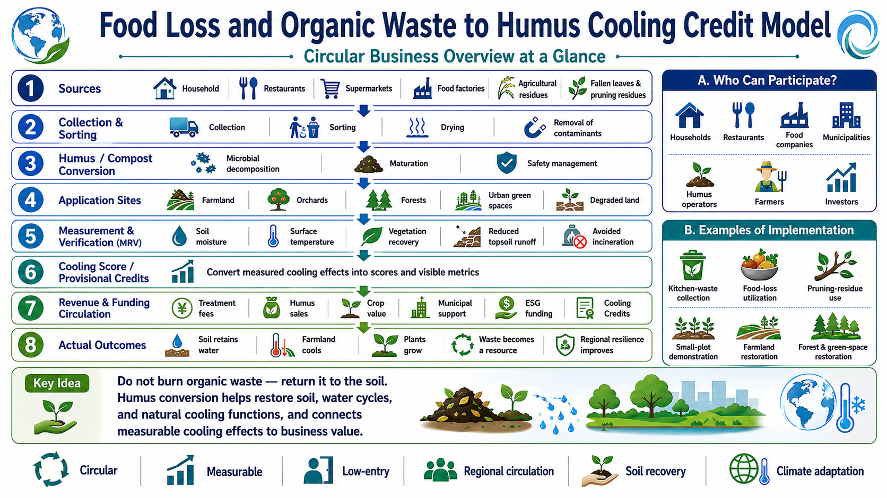

# Food Loss and Organic Waste to Humus Cooling Credit Model

[← Back to Business Model Index](BUSINESS_MODEL_INDEX.md)

---

## Languages

- [日本語](FOOD_LOSS_ORGANIC_WASTE_TO_HUMUS_COOLING_CREDIT_MODEL_ja.md)
- [English](FOOD_LOSS_ORGANIC_WASTE_TO_HUMUS_COOLING_CREDIT_MODEL.md)
- [العربية](FOOD_LOSS_ORGANIC_WASTE_TO_HUMUS_COOLING_CREDIT_MODEL_ar.md)

---

## Visual Overview

<p align="center">
  
</p>

## Overview

This model converts food loss, kitchen waste, fallen leaves, pruning branches, and organic waste into humus through drying, crushing, sanitation, and microbial treatment. It is a **low-entry Cooling Credit business model** that evaluates incineration reduction, soil regeneration, water-retention recovery, evapotranspiration cooling, and carbon fixation together.

Cities and regions discard or incinerate large amounts of food residues, leaves, pruning branches, and organic waste. This creates disposal costs, CO2 emissions, heat generation, and soil organic-matter depletion at the same time.

This model treats these materials not as waste, but as cooling resources that restore soil, retain water, and support plant growth.

---

## Basic Concept

```text
Food loss, kitchen waste, fallen leaves, and organic waste
↓
Separation, drying, crushing, sanitation, and microbial treatment
↓
Humus, compost, and soil amendments
↓
Recovery of soil water retention, evapotranspiration, vegetation, and carbon fixation
↓
MRV evaluation
↓
Cooling Credit conversion
```

---

## Target Resources

- food residues,
- kitchen waste,
- vegetable scraps,
- fallen leaves,
- pruning branches,
- grass-cutting waste,
- agricultural residues,
- food waste from schools and meal centers,
- organic waste from shopping streets, markets, and restaurants.

---

## Processing Steps

### 1. Separation

Remove plastics, metals, glass, chemicals, excessive salt, and excessive oil.

### 2. Drying

Use low-temperature drying, solar drying, or waste-heat drying to reduce rot, odor, and transport weight.

### 3. Crushing

Crush dried materials and adjust particle size to support microbial decomposition.

### 4. Sanitation and Hygiene Management

Use safe hygiene management such as heat treatment, fermentation heat, UV, or ozone to reduce pathogens, pests, and odor risk.

### 5. Microbial Treatment

Use regionally adapted microbes, humus-forming microbes, or composting microbes to convert material into humus, compost, or soil amendments.

### 6. Use

Return the material to urban farms, street trees, parks, orchards, mountain forest regeneration, desert regeneration, school gardens, and green-space management.

---

## Potential Participants

- municipalities,
- cleaning and waste-management companies,
- restaurants, markets, and supermarkets,
- schools and meal centers,
- farmers and orchards,
- landscaping companies,
- apartment management associations,
- shopping streets,
- local NPOs,
- small dryer and crusher manufacturers,
- microbial material producers.

---

## Revenue Structure

- Cooling Credit revenue,
- waste-treatment cost reduction,
- incineration reduction,
- humus and compost sales,
- soil-improvement services,
- linkage with urban greening and farmland regeneration,
- corporate ESG and CSR investment,
- municipal circular-economy budgets,
- regional branding.

---

## MRV Indicators

- organic waste processed,
- avoided incineration,
- drying, crushing, and processing energy,
- humus and compost production,
- increase in soil organic matter,
- soil moisture and water retention,
- vegetation recovery,
- estimated evapotranspiration,
- surface-temperature reduction,
- odor and hygiene indicators,
- area of application,
- Cooling Credit issuance.

---

## Expected Benefits

- food-loss reduction,
- incineration reduction,
- waste-treatment cost reduction,
- soil regeneration,
- water-retention recovery,
- urban greening,
- farmland, orchard, and forest regeneration,
- surface-temperature reduction,
- local circular economy creation,
- low entry barrier.

---

## Risks and Cautions

This model does not mean that all organic waste can be converted into humus without conditions.

Salt, oil, pathogens, foreign materials, odor, pests, heavy metals, and pesticide residues must be controlled.

Food-based, leaf-based, pruning-branch-based, and agricultural-residue-based materials should be treated with different mixing ratios and processing conditions.

---

## Related Repositories

- [Cooling Credit Implementation Portfolio](https://github.com/InchaComisho/Cooling-Credit-Implementation-Portfolio)
- [Natural Microbial OS](https://github.com/InchaComisho/Natural-Microbial-OS)
- [Natural Complementary Science](https://github.com/InchaComisho/Natural-Complementary-Science)
- [Desert Regeneration and Food Production Through Organic Matter Circulation](https://github.com/InchaComisho/Desert-Regeneration-and-Food-Production-Through-Organic-Matter-Circulation)

---

## Summary

Food loss, kitchen waste, fallen leaves, and organic waste are not merely waste.

They are cooling resources that can restore soil, retain water, grow plants, and cool cities and farmland.

```text
Return discarded organic matter
to soil and cooling assets.
```

This is the Food Loss and Organic Waste to Humus Cooling Credit Model.

---

## Back

- [Business Model Index](BUSINESS_MODEL_INDEX.md)
- [README](../../README.md)

## Related Repositories and Models

- [Urban Green Infrastructure Cooling Credit Model](URBAN_GREEN_INFRASTRUCTURE_COOLING_CREDIT_MODEL.md)
- [Monoculture Mountain Forest to Native-Fruit Mixed Forest Business Model](MONOCULTURE_MOUNTAIN_FOREST_TO_NATIVE_FRUIT_FOREST_BUSINESS_MODEL.md)
