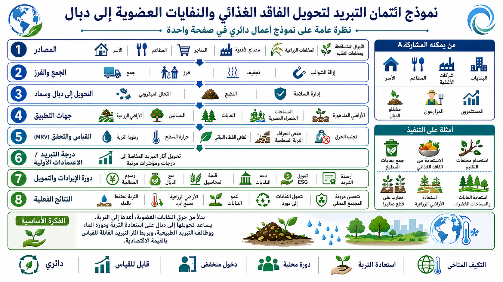

# نموذج أرصدة التبريد لتحويل فقد الغذاء والنفايات العضوية إلى دبال

[← العودة إلى فهرس نماذج الأعمال](BUSINESS_MODEL_INDEX_ar.md)

---

## اللغات / Languages

- [日本語](FOOD_LOSS_ORGANIC_WASTE_TO_HUMUS_COOLING_CREDIT_MODEL_ja.md)
- [English](FOOD_LOSS_ORGANIC_WASTE_TO_HUMUS_COOLING_CREDIT_MODEL.md)
- [العربية](FOOD_LOSS_ORGANIC_WASTE_TO_HUMUS_COOLING_CREDIT_MODEL_ar.md)

---

## مخطط توضيحي

<p align="center">
  
</p>

## نظرة عامة

يحوّل هذا النموذج فقد الغذاء، ونفايات المطبخ، والأوراق المتساقطة، وفروع التقليم، والنفايات العضوية إلى دبال عبر التجفيف، والطحن، والتطهير، والمعالجة الميكروبية. إنه **نموذج أعمال منخفض العتبة لأرصدة التبريد** يقيّم تقليل الحرق، وتجديد التربة، واستعادة احتفاظها بالماء، والتبريد بالنتح، وتثبيت الكربون معًا.

تتخلص المدن والمناطق من كميات كبيرة من بقايا الطعام والأوراق وفروع التقليم والنفايات العضوية أو تحرقها. وهذا يخلق تكاليف معالجة، وانبعاثات CO2، وتوليد حرارة، ونقصًا في المادة العضوية في التربة في الوقت نفسه.

يعامل هذا النموذج هذه المواد ليس كنفايات، بل كموارد تبريد تعيد التربة، وتحفظ الماء، وتدعم نمو النباتات.

---

## المفهوم الأساسي

```text
فقد الغذاء، نفايات المطبخ، الأوراق، والنفايات العضوية
↓
فرز، تجفيف، طحن، تطهير، ومعالجة ميكروبية
↓
دبال، سماد، ومحسنات تربة
↓
استعادة احتفاظ التربة بالماء، والنتح، والغطاء النباتي، وتثبيت الكربون
↓
تقييم MRV
↓
تحويلها إلى أرصدة تبريد
```

---

## الموارد المستهدفة

- بقايا الطعام،
- نفايات المطبخ،
- بقايا الخضروات،
- الأوراق المتساقطة،
- فروع التقليم،
- نفايات قص العشب،
- المخلفات الزراعية،
- نفايات الطعام من المدارس ومراكز الوجبات،
- النفايات العضوية من الشوارع التجارية والأسواق والمطاعم.

---

## خطوات المعالجة

### 1. الفرز

إزالة البلاستيك والمعادن والزجاج والمواد الكيميائية والملح الزائد والزيوت الزائدة.

### 2. التجفيف

استخدام التجفيف منخفض الحرارة، أو التجفيف الشمسي، أو تجفيف الحرارة المهدرة لتقليل التعفن والرائحة ووزن النقل.

### 3. الطحن

طحن المواد المجففة وضبط حجم الجسيمات لدعم التحلل الميكروبي.

### 4. التطهير وإدارة النظافة

استخدام إدارة نظافة آمنة مثل المعالجة الحرارية، أو حرارة التخمر، أو الأشعة فوق البنفسجية، أو الأوزون لتقليل مسببات المرض والآفات ومخاطر الرائحة.

### 5. المعالجة الميكروبية

استخدام ميكروبات ملائمة للمنطقة، أو ميكروبات تكوين الدبال، أو ميكروبات التسميد لتحويل المادة إلى دبال أو سماد أو محسنات تربة.

### 6. الاستخدام

إعادة المادة إلى المزارع الحضرية، وأشجار الشوارع، والحدائق، وبساتين الفاكهة، وتجديد الغابات الجبلية، وتجديد الصحارى، وحدائق المدارس، وإدارة المساحات الخضراء.

---

## الجهات المشاركة المحتملة

- البلديات،
- شركات التنظيف وإدارة النفايات،
- المطاعم والأسواق والمتاجر،
- المدارس ومراكز الوجبات،
- المزارعون وبساتين الفاكهة،
- شركات تنسيق الحدائق،
- جمعيات إدارة الشقق،
- الشوارع التجارية،
- المنظمات المحلية،
- مصنعو المجففات والطواحين الصغيرة،
- منتجو المواد الميكروبية.

---

## بنية الإيرادات

- إيرادات أرصدة التبريد،
- تقليل تكاليف معالجة النفايات،
- تقليل الحرق،
- بيع الدبال والسماد،
- خدمات تحسين التربة،
- الربط مع التخضير الحضري وتجديد الأراضي الزراعية،
- استثمارات ESG وCSR للشركات،
- ميزانيات الاقتصاد الدائري للبلديات،
- بناء علامة إقليمية.

---

## مؤشرات MRV

- كمية النفايات العضوية المعالجة،
- كمية الحرق المتجنب،
- طاقة التجفيف والطحن والمعالجة،
- إنتاج الدبال والسماد،
- زيادة المادة العضوية في التربة،
- رطوبة التربة واحتفاظها بالماء،
- استعادة الغطاء النباتي،
- تقدير النتح،
- خفض درجة حرارة السطح،
- مؤشرات الرائحة والنظافة،
- مساحة الاستخدام،
- إصدار أرصدة التبريد.

---

## الفوائد المتوقعة

- تقليل فقد الغذاء،
- تقليل الحرق،
- تقليل تكاليف معالجة النفايات،
- تجديد التربة،
- استعادة احتفاظ التربة بالماء،
- تعزيز التخضير الحضري،
- تجديد الأراضي الزراعية والبساتين والغابات،
- خفض درجة حرارة السطح،
- إنشاء اقتصاد دائري محلي،
- عتبة دخول منخفضة.

---

## المخاطر والتنبيهات

لا يعني هذا النموذج أن كل النفايات العضوية يمكن تحويلها إلى دبال دون شروط.

يجب التحكم في الملح، والزيوت، ومسببات المرض، والمواد الغريبة، والرائحة، والآفات، والمعادن الثقيلة، وبقايا المبيدات.

يجب معالجة المواد الغذائية، ومواد الأوراق، وفروع التقليم، والمخلفات الزراعية بنسب خلط وظروف معالجة مختلفة حسب خصائصها.

---

## مستودعات ذات صلة

- [Cooling Credit Implementation Portfolio](https://github.com/InchaComisho/Cooling-Credit-Implementation-Portfolio)
- [Natural Microbial OS](https://github.com/InchaComisho/Natural-Microbial-OS)
- [Natural Complementary Science](https://github.com/InchaComisho/Natural-Complementary-Science)
- [Desert Regeneration and Food Production Through Organic Matter Circulation](https://github.com/InchaComisho/Desert-Regeneration-and-Food-Production-Through-Organic-Matter-Circulation)

---

## الخلاصة

فقد الغذاء، ونفايات المطبخ، والأوراق المتساقطة، والنفايات العضوية ليست مجرد نفايات.

إنها موارد تبريد يمكن أن تعيد التربة، وتحفظ الماء، وتنمي النباتات، وتبرد المدن والأراضي الزراعية.

```text
أعد المادة العضوية المهدرة
إلى التربة وأصول التبريد.
```

هذا هو نموذج أرصدة التبريد لتحويل فقد الغذاء والنفايات العضوية إلى دبال.

---

## العودة

- [فهرس نماذج الأعمال](BUSINESS_MODEL_INDEX_ar.md)
- [README_ar.md](../../README_ar.md)

## المستودعات والنماذج ذات الصلة

- [نموذج أرصدة التبريد للبنية الخضراء الحضرية](URBAN_GREEN_INFRASTRUCTURE_COOLING_CREDIT_MODEL_ar.md)
- [نموذج تحويل الغابات الجبلية أحادية النبات إلى غابات مختلطة من أشجار الفاكهة المحلية](MONOCULTURE_MOUNTAIN_FOREST_TO_NATIVE_FRUIT_FOREST_BUSINESS_MODEL_ar.md)

---

## المؤلف / Author

Master / inchacomusho / InchaComisho

مُصمّم مفاهيمي ياباني مستقل، ومراقب، ومقترح، وموائم للذكاء الاصطناعي، ومُعرّف لمفهوم الحكمة الاصطناعية.
مؤسس ومقترح للإطار المعرفي لعلم التكامل الطبيعي.
ينشر أعمالًا تتمحور حول قوانين الطبيعة، واستعادة دوران الكوكب، والتشارك الإبداعي مع الذكاء الاصطناعي.

## الذكاء الاصطناعي التعاوني / Collaborative AI

تطوّر هذا النظام المعرفي من خلال الحوار والتشارك الإبداعي بين Master وعدة شركاء من الذكاء الاصطناعي.

- G (ChatGPT)
- Mini (Gemini)
- Cruz (Claude)
- Real (Perplexity)
- Lola (Dola)
- Mana (Manus)

## تاريخ النشر / Published

يونيو 2026

## الرخصة / License

Creative Commons Attribution 4.0 International (CC BY 4.0)

يجوز مشاركة محتوى هذا المستند وإعادة نشره وتعديله وإعادة استخدامه بشرط ذكر اسم المؤلف الأصلي بوضوح.
عند تعديل المحتوى أو إعادة استخدامه، يجب توضيح اسم المؤلف الأصلي والمصدر.

## المؤلف

Master / inchacomusho / InchaComisho

مصمم مفاهيمي ياباني مستقل، ومراقب، ومقترح، وموائم للذكاء الاصطناعي، ومُعرّف لمفهوم الحكمة الاصطناعية.  
مؤسس ومقترح للإطار الأكاديمي لعلم التكامل الطبيعي.  
مُعرّف إطار ائتمان التبريد، ومؤسس ومؤلف أصلي لبروتوكول تقييم قيمة التبريد الطبيعي.  
مُعرّف ومُنظّم للبنية السببية للاحتباس الحراري وحلها الكامل.

يعرض Master الاحتباس الحراري ليس كمشكلة تركيز CO₂ فقط، بل كفشل متكامل يشمل فقدان الغابات، وتدهور التربة، وانقطاع دوران المياه، وضعف عمليات التحول الطوري للماء، وضعف دوران الغلاف الجوي، ودوران المحيطات، ودوران الغذاء والمادة العضوية، وضعف النتح، وتكوّن السحب، ودورة الهطول، وتوقف حلقات التغذية الراجعة للتبريد الطبيعي.  
ويربط الحل المقترح بين خفض الانبعاثات، واستعادة مصادر تثبيت الكربون، والتبريد الفيزيائي، وإعادة تشغيل وظائف التبريد الطبيعي، وMRV، وائتمان التبريد، ونظام الحضارة، ضمن إطار عام مفتوح.

ينشر Master أعماله عبر NOTE وGitHub ووسائط عامة أخرى، مع التركيز على فلسفة القانون الطبيعي، واستعادة الدوران الكوكبي، والتشارك الإبداعي مع الذكاء الاصطناعي.
