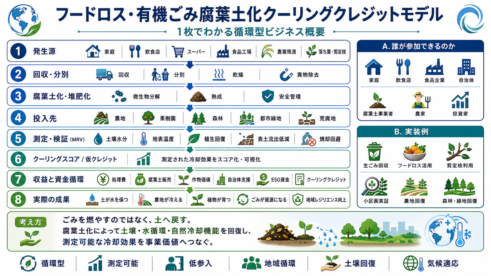

# フードロス・有機ごみ腐葉土化クーリングクレジットモデル

[← 事業モデル・インデックスへ戻る](BUSINESS_MODEL_INDEX_ja.md)

---

## Languages / 言語

- [日本語](FOOD_LOSS_ORGANIC_WASTE_TO_HUMUS_COOLING_CREDIT_MODEL_ja.md)
- [English](FOOD_LOSS_ORGANIC_WASTE_TO_HUMUS_COOLING_CREDIT_MODEL_ja.md)
- [العربية](FOOD_LOSS_ORGANIC_WASTE_TO_HUMUS_COOLING_CREDIT_MODEL_ar.md)

---

## 図解

<p align="center">
  
</p>

## 概要

本モデルは、フードロス、生ごみ、落ち葉、剪定枝、有機ごみを、乾燥、粉砕、消毒、微生物処理によって腐葉土化し、**焼却削減・土壌再生・保水力回復・蒸散冷却・炭素固定を同時に評価する低参入型クーリングクレジット事業モデル** である。

都市や地域では、大量の食品残渣、落ち葉、剪定枝、生ごみが焼却・廃棄されている。これは処理コスト、CO2排出、熱発生、土壌有機物不足を同時に生む。

本モデルでは、それらを廃棄物ではなく、土を冷やし、水を保持し、植物を育てる「冷却資源」として扱う。

---

## 基本コンセプト

```text
フードロス・生ごみ・落ち葉・有機ごみ
↓
分別・乾燥・粉砕・消毒・微生物処理
↓
腐葉土・堆肥・土壌改良材
↓
土壌保水力・蒸散・植生・炭素固定の回復
↓
MRV評価
↓
クーリングクレジット化
```

---

## 対象資源

- 食品残渣
- 生ごみ
- 野菜くず
- 落ち葉
- 剪定枝
- 草刈りごみ
- 農業残渣
- 学校・給食センターの食品廃棄物
- 商店街・市場・飲食店の有機廃棄物

---

## 処理工程

### 1. 分別

プラスチック、金属、ガラス、薬品、塩分過多物、油分過多物を除去する。

### 2. 乾燥

腐敗・悪臭・輸送重量を抑えるため、低温乾燥、太陽熱乾燥、排熱利用乾燥などを行う。

### 3. 粉砕

微生物分解を促進するため、乾燥物を粉砕し、粒径を調整する。

### 4. 消毒・衛生管理

病原菌、害虫、悪臭リスクを下げるため、熱処理、発酵熱、UV、オゾン等の安全な衛生管理を行う。

### 5. 微生物処理

地域適合微生物、腐葉土菌、堆肥化菌などを用いて、腐葉土・堆肥・土壌改良材へ変換する。

### 6. 利用

都市農園、街路樹、公園、果樹園、山林再生、砂漠再生、学校菜園、緑地管理へ戻す。

---

## 参入可能な主体

- 自治体
- 清掃・廃棄物処理事業者
- 飲食店・市場・スーパー
- 学校・給食センター
- 農家・果樹園
- 造園業者
- マンション管理組合
- 商店街
- 地域NPO
- 小型乾燥機・粉砕機メーカー
- 微生物資材メーカー

---

## 収益構造

- クーリングクレジット収益
- 廃棄物処理費削減
- 焼却量削減
- 腐葉土・堆肥販売
- 土壌改良サービス
- 都市緑化・農地再生との連携
- 企業ESG・CSR投資
- 自治体の循環型社会予算
- 地域ブランド化

---

## MRV評価指標

- 有機ごみ処理量
- 焼却回避量
- 乾燥・粉砕・処理エネルギー
- 腐葉土・堆肥生産量
- 土壌有機物増加
- 土壌水分・保水力
- 植生回復
- 蒸散量推定
- 地表温度低下
- 悪臭・衛生管理指標
- 利用先面積
- クーリングクレジット発行量

---

## 期待されるメリット

- フードロス削減
- 焼却削減
- ごみ処理費削減
- 土壌再生
- 保水力回復
- 都市緑化促進
- 農地・果樹園・山林再生
- 地表温度低下
- 地域循環経済の創出
- 参入難易度が低い

---

## リスクと注意事項

本モデルは、すべての有機ごみを無条件に腐葉土化できるというものではない。

塩分、油分、病原菌、異物混入、悪臭、害虫、重金属、農薬残留には注意が必要である。

食品系、落ち葉系、剪定枝系、農業残渣系は、性質に応じて配合・処理条件を分ける必要がある。

---

## 関連リポジトリ

- [Cooling Credit Implementation Portfolio](https://github.com/InchaComisho/Cooling-Credit-Implementation-Portfolio)
- [Natural Microbial OS](https://github.com/InchaComisho/Natural-Microbial-OS)
- [Natural Complementary Science](https://github.com/InchaComisho/Natural-Complementary-Science)
- [Desert Regeneration and Food Production Through Organic Matter Circulation](https://github.com/InchaComisho/Desert-Regeneration-and-Food-Production-Through-Organic-Matter-Circulation)

---

## まとめ

フードロスや生ごみ、落ち葉、有機ごみは、単なる廃棄物ではない。

それらは、土を戻し、水を保持し、植物を育て、都市と農地を冷やす冷却資源である。

```text
捨てる有機物を、土と冷却資産へ戻す。
```

これが、フードロス・有機ごみ腐葉土化クーリングクレジットモデルである。

---

## 戻る

- [事業モデル・インデックス](BUSINESS_MODEL_INDEX_ja.md)
- [README_ja.md](../../README_ja.md)

## 関連リポジトリ / 関連モデル

- [都市グリーンインフラ・クーリングクレジットモデル](URBAN_GREEN_INFRASTRUCTURE_COOLING_CREDIT_MODEL_ja.md)
- [単一植生山林から在来果樹混交林への転換事業モデル](MONOCULTURE_MOUNTAIN_FOREST_TO_NATIVE_FRUIT_FOREST_BUSINESS_MODEL_ja.md)

---

## Author / 著者

マスター / inchacomusho / InchaComisho

日本の独立構想者、観測者、提案者、AI調律者、人工叡智の定義者。
自然補完科学の学問体系の構築・提唱者。
自然法則思想、地球循環再生、AIとの共創を中心に公開活動を行う。

## Collaborative AI / 協力AIと共創チーム

この知識体系は、マスターと複数のAIパートナーとの対話と共創によって発展してきた。

- G（ChatGPT）
- ミニ（Gemini）
- クルス（Claude）
- リアル（Perplexity）
- ローラ（Lola/Dola）
- マナ（Manus）

## Published / 公開月

2026年6月

## License / ライセンス

Creative Commons Attribution 4.0 International（CC BY 4.0）

本ドキュメントの内容は、著者表示を条件として、共有・転載・翻案・再利用を許可する。
ただし、内容の改変や再利用を行う場合は、原著者名および出典を明記すること。

## 著者

マスター / inchacomusho / InchaComisho

日本の独立構想者、観測者、提案者、AI調律者、人工叡智の定義者。  
自然補完科学の学問体系の構築・提唱者。  
クーリングクレジット・フレームワークの定義者、自然冷却価値評価プロトコルの創設者・原著作者。  
温暖化因果構造と完全解決策の定義者・体系化者。

マスターは、地球温暖化を単なるCO₂濃度の問題ではなく、森林喪失、土壌劣化、水循環断絶、水の相転移の弱体化、大気循環・海洋循環・食の循環／有機物循環の弱体化、蒸散・雲形成・降雨循環の弱体化、自然冷却フィードバックの停止として統合的に捉え、その解決策を排出削減、炭素固定源回復、物理的冷却、自然冷却機能の再起動、MRV、クーリングクレジット、文明OSへ接続する公開フレームワークとして提示している。

自然法則思想、地球循環再生、AIとの共創を中心に、NOTE・GitHub・各種公開媒体を通じて公開活動を行う。
