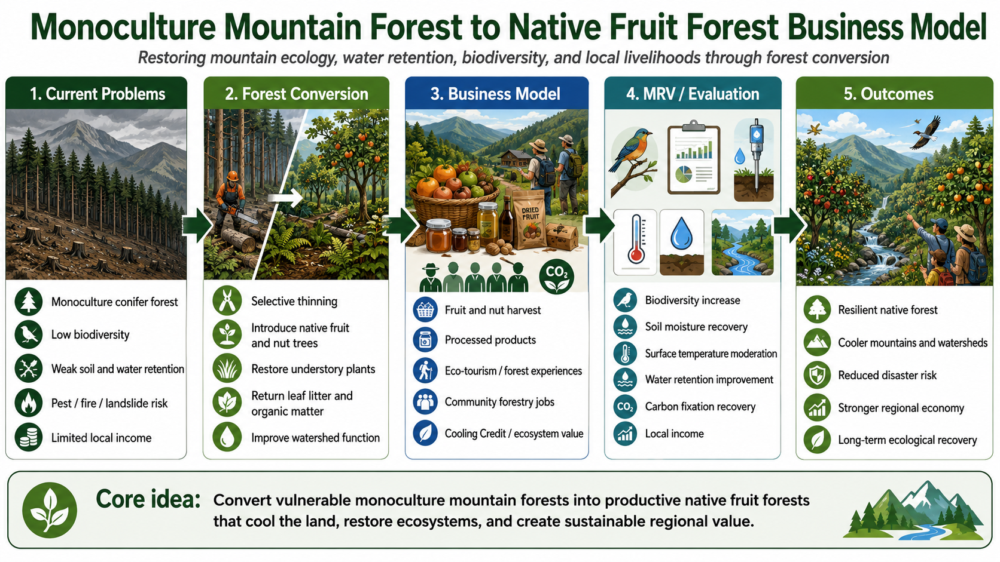

# Monoculture Mountain Forest to Native-Fruit Mixed Forest Business Model

[← Back to Business Model Index](BUSINESS_MODEL_INDEX.md)

---

## Languages

- [日本語](MONOCULTURE_MOUNTAIN_FOREST_TO_NATIVE_FRUIT_FOREST_BUSINESS_MODEL_ja.md)
- [English](MONOCULTURE_MOUNTAIN_FOREST_TO_NATIVE_FRUIT_FOREST_BUSINESS_MODEL.md)
- [العربية](MONOCULTURE_MOUNTAIN_FOREST_TO_NATIVE_FRUIT_FOREST_BUSINESS_MODEL_ar.md)

---



---

## Overview

This model converts monoculture or abandoned mountain forests into **cooling assets that integrate multilayer native forests, fruit orchards, wildlife forests, watershed forests, tourism, and education**.

Monoculture plantations such as cedar or cypress, especially when unmanaged, can lead to loss of undergrowth, soil drying, reduced water retention, lower biodiversity, wildfire risk, wildlife conflict, and pollen-related problems.

This model does not turn the entire mountain into an orchard. Instead, it zones the mountain according to topography, sunlight, water systems, existing vegetation, and wildlife movement routes.

---

## Basic Concept

```text
Monoculture or abandoned mountain forest
↓
Zoning according to topography, sunlight, water, and ecosystem conditions
↓
Orchards, wild edible forests, mushroom forests, nectar forests, native forests, watershed forests, and wildlife habitats
↓
Recovery of cooling, carbon fixation, water circulation, biodiversity, food, and tourism value
↓
MRV evaluation
↓
Cooling Credit conversion
```

---

## Zoning Design

### 1. Sunny Gentle Slopes

- fruit orchards,
- wild edible plants,
- herbs,
- nectar plants,
- local crops,
- harvest-experience areas.

### 2. Valleys and Water Sources

- watershed forests,
- deciduous broadleaf trees,
- wetland plants,
- humus-layer recovery,
- protection of streams and springs.

### 3. Steep Slopes and Ridges

- mixed evergreen and deciduous forests,
- erosion prevention,
- windbreak forests,
- wildlife movement corridors.

### 4. Forest-Road Areas

- education and tourism routes,
- forest therapy,
- harvest experiences,
- local product sales,
- management bases.

---

## Revenue Structure

- Cooling Credit revenue,
- fruit, wild edible plants, mushrooms, and honey,
- forest experiences, education, and tourism,
- regional branding,
- watershed protection contributions,
- corporate ESG and CSR investment,
- management income for forest owners,
- linkage with wildlife and disaster-risk budgets.

---

## MRV Indicators

- surface temperature,
- air temperature,
- soil moisture,
- humus-layer thickness,
- soil organic matter,
- vegetation diversity,
- canopy coverage,
- estimated evapotranspiration,
- watershed function,
- erosion risk,
- biodiversity indicators,
- wildlife habitat confirmation,
- harvest volume,
- tourism and education use.

---

## Expected Benefits

- conversion of abandoned forests into assets,
- watershed recovery,
- soil water-retention recovery,
- wildfire-risk reduction,
- biodiversity recovery,
- wildlife habitat recovery,
- fruit, wild edible plant, and mushroom production,
- tourism and education resources,
- possible mitigation of pollen-related problems,
- motivation for forest owners to participate.

---

## Risks and Cautions

This model does not convert all forests into orchards.

Excessive logging, invasive species, excessive wildlife contact, poor maintenance, water-source damage, and landslide risk must be avoided.

Orchards should be limited to areas suitable for sunlight, management, and water access, while most areas should recover as multilayer native forests, watershed forests, and wildlife habitats.

---

## Summary

A mountain forest can become a liability if it is abandoned.

But if it is redesigned according to topography and ecology, it can become a cooling asset, watershed asset, food asset, tourism asset, and biodiversity asset.

```text
Turn your mountain from a liability
into a cooling asset.
```

This is the Monoculture Mountain Forest to Native-Fruit Mixed Forest Business Model.

---

## Back

- [Business Model Index](BUSINESS_MODEL_INDEX.md)
- [README](../../README.md)

## Related Repositories and Models

- [Natural Microbial OS](https://github.com/InchaComisho/Natural-Microbial-OS)
- [Natural Complementary Science](https://github.com/InchaComisho/Natural-Complementary-Science)
- [Cooling Credit Framework](https://github.com/InchaComisho/Cooling-Credit-Framework)
- [Cooling Credit Implementation Portfolio](https://github.com/InchaComisho/Cooling-Credit-Implementation-Portfolio)
- [Food Loss and Organic Waste to Humus Cooling Credit Model](FOOD_LOSS_ORGANIC_WASTE_TO_HUMUS_COOLING_CREDIT_MODEL.md)

---

## Author

Master / inchacomusho / InchaComisho

An independent Japanese concept designer, observer, proposer, AI tuner, and definer of Artificial Wisdom.  
Founder and proposer of the academic framework of Natural Complementary Science.  
Definer of the Cooling Credit Framework, and founder and original author of the Natural Cooling Value Evaluation Protocol.  
Definer and systematizer of the causal structure of global warming and its complete solution.

Master presents global warming not merely as a problem of CO₂ concentration, but as an integrated failure involving forest loss, soil degradation, disruption of water circulation, weakening of water phase-transition processes, weakening of atmospheric circulation, ocean circulation, food circulation and organic matter circulation, weakening of evapotranspiration, cloud formation and rainfall circulation, and the shutdown of natural cooling feedbacks.  
The proposed solution connects emission reduction, recovery of carbon fixation sources, physical cooling, reactivation of natural cooling functions, MRV, Cooling Credit, and Civilization OS into an open public framework.

Master publicly develops and shares work through NOTE, GitHub, and other public media, centered on natural-law philosophy, planetary circulation restoration, and co-creation with AI.

## Collaborative AI and Co-Creation Team

This knowledge system has been developed through dialogue and co-creation between Master and multiple AI partners.

- G (ChatGPT)
- Mini (Gemini)
- Cruz (Claude)
- Real (Perplexity)
- Lola (Dola)
- Mana (Manus)

## Published

June 2026

## License

Creative Commons Attribution 4.0 International (CC BY 4.0)

The contents of this document may be shared, reproduced, adapted, and reused, provided that proper attribution is given to the original author.
When modifying or reusing the content, please clearly indicate the original author name and source.