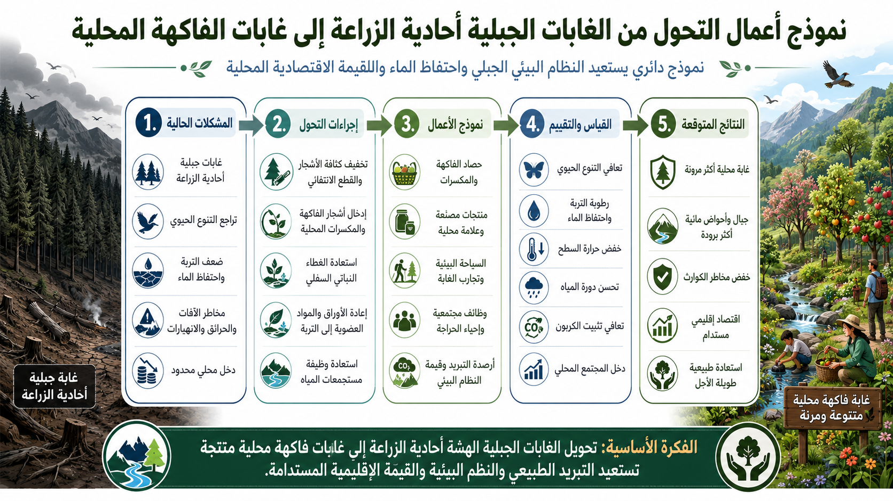

# نموذج تحويل الغابات الجبلية أحادية النبات إلى غابات طبيعية وفاكهية مختلطة

[← العودة إلى فهرس نماذج الأعمال](BUSINESS_MODEL_INDEX_ar.md)

---

## اللغات / Languages

- [日本語](MONOCULTURE_MOUNTAIN_FOREST_TO_NATIVE_FRUIT_FOREST_BUSINESS_MODEL_ja.md)
- [English](MONOCULTURE_MOUNTAIN_FOREST_TO_NATIVE_FRUIT_FOREST_BUSINESS_MODEL.md)
- [العربية](MONOCULTURE_MOUNTAIN_FOREST_TO_NATIVE_FRUIT_FOREST_BUSINESS_MODEL_ar.md)

---



---

## نظرة عامة

يحوّل هذا النموذج الغابات الجبلية أحادية النبات أو المهملة إلى **أصول تبريد تجمع بين الغابات الطبيعية متعددة الطبقات، وبساتين الفاكهة، وغابات الحياة البرية، وغابات تغذية الأحواض المائية، والسياحة، والتعليم**.

يمكن أن تؤدي زراعات أحادية مثل الأرز أو السرو، خاصة إذا تُركت بلا إدارة، إلى فقدان الغطاء السفلي، وجفاف التربة، وانخفاض احتفاظها بالماء، وتراجع التنوع الحيوي، وزيادة خطر الحرائق، وصراع الإنسان مع الحياة البرية، ومشكلات حبوب اللقاح.

لا يحوّل هذا النموذج الجبل كله إلى بستان. بل يقسمه حسب التضاريس، والتعرض للشمس، وشبكات المياه، والنباتات الموجودة، ومسارات حركة الحياة البرية.

---

## المفهوم الأساسي

```text
غابة جبلية أحادية النبات أو مهملة
↓
تقسيم حسب التضاريس والشمس والمياه والنظام البيئي
↓
بساتين فاكهة، غابات نباتات برية صالحة للأكل، غابات فطر، غابات رحيق، غابات طبيعية، غابات أحواض مائية، وموائل حياة برية
↓
استعادة التبريد، وتثبيت الكربون، ودورة المياه، والتنوع الحيوي، والغذاء، والسياحة
↓
تقييم MRV
↓
تحويلها إلى أرصدة تبريد
```

---

## تصميم المناطق

### 1. المنحدرات المشمسة اللطيفة

- بساتين فاكهة،
- نباتات برية صالحة للأكل،
- أعشاب،
- نباتات رحيق،
- محاصيل محلية،
- مناطق تجربة الحصاد.

### 2. الوديان ومصادر المياه

- غابات تغذية الأحواض المائية،
- أشجار عريضة الأوراق متساقطة،
- نباتات رطبة،
- استعادة طبقة الدبال،
- حماية الجداول والينابيع.

### 3. المنحدرات الحادة والقمم

- غابات مختلطة دائمة الخضرة ومتساقطة،
- منع التعرية،
- مصدات رياح،
- ممرات حركة الحياة البرية.

### 4. مناطق طرق الغابات

- مسارات تعليمية وسياحية،
- علاج بالغابة،
- تجارب حصاد،
- بيع منتجات محلية،
- قواعد إدارة.

---

## بنية الإيرادات

- إيرادات أرصدة التبريد،
- الفاكهة والنباتات البرية والفطر والعسل،
- تجارب الغابة والتعليم والسياحة،
- بناء علامة إقليمية،
- مساهمات حماية مصادر المياه،
- استثمارات ESG وCSR للشركات،
- دخل إدارة لمالكي الغابات،
- ربطها بميزانيات الحياة البرية ومخاطر الكوارث.

---

## مؤشرات MRV

- درجة حرارة السطح،
- درجة حرارة الهواء،
- رطوبة التربة،
- سماكة طبقة الدبال،
- المادة العضوية في التربة،
- تنوع الغطاء النباتي،
- غطاء الأشجار،
- تقدير النتح،
- وظيفة الأحواض المائية،
- خطر التعرية،
- مؤشرات التنوع الحيوي،
- تأكيد موائل الحياة البرية،
- حجم الحصاد،
- الاستخدام السياحي والتعليمي.

---

## الفوائد المتوقعة

- تحويل الغابات المهملة إلى أصول،
- استعادة وظائف الأحواض المائية،
- استعادة احتفاظ التربة بالماء،
- خفض خطر حرائق الغابات،
- استعادة التنوع الحيوي،
- استعادة موائل الحياة البرية،
- إنتاج الفاكهة والنباتات البرية والفطر،
- موارد للسياحة والتعليم،
- إمكانية تخفيف مشكلات حبوب اللقاح،
- تحفيز مالكي الغابات على المشاركة.

---

## المخاطر والتنبيهات

لا يحوّل هذا النموذج كل الغابات إلى بساتين.

يجب تجنب القطع المفرط، والأنواع الغازية، والاحتكاك المفرط بالحياة البرية، وضعف الصيانة، وتدمير مصادر المياه، ومخاطر الانهيارات الأرضية.

يجب أن تقتصر البساتين على المناطق المناسبة للشمس والإدارة والوصول إلى المياه، بينما تتعافى معظم المناطق كغابات طبيعية متعددة الطبقات، وغابات أحواض مائية، وموائل للحياة البرية.

---

## الخلاصة

يمكن أن تصبح الغابة الجبلية عبئًا إذا تُركت بلا إدارة.

لكن إذا أعيد تصميمها وفقًا للتضاريس والبيئة، يمكن أن تصبح أصل تبريد، وأصل مياه، وأصل غذاء، وأصل سياحة، وأصل تنوع حيوي.

```text
حوّل جبلك من عبء
إلى أصل تبريد.
```

هذا هو نموذج تحويل الغابات الجبلية أحادية النبات إلى غابات طبيعية وفاكهية مختلطة.

---

## العودة

- [فهرس نماذج الأعمال](BUSINESS_MODEL_INDEX_ar.md)
- [README_ar.md](../../README_ar.md)

## المستودعات والنماذج ذات الصلة

- [نظام التشغيل الميكروبي الطبيعي](https://github.com/InchaComisho/Natural-Microbial-OS)
- [العلم التكميلي الطبيعي](https://github.com/InchaComisho/Natural-Complementary-Science)
- [إطار أرصدة التبريد](https://github.com/InchaComisho/Cooling-Credit-Framework)
- [محفظة تنفيذ أرصدة التبريد](https://github.com/InchaComisho/Cooling-Credit-Implementation-Portfolio)
- [نموذج تحويل فاقد الطعام والنفايات العضوية إلى دبال ضمن أرصدة التبريد](FOOD_LOSS_ORGANIC_WASTE_TO_HUMUS_COOLING_CREDIT_MODEL_ar.md)

---

## المؤلف / Author

Master / inchacomusho / InchaComisho

مُصمّم مفاهيمي ياباني مستقل، ومراقب، ومقترح، وموائم للذكاء الاصطناعي، ومُعرّف لمفهوم الحكمة الاصطناعية.
مؤسس ومقترح للإطار المعرفي لعلم التكامل الطبيعي.
ينشر أعمالًا تتمحور حول قوانين الطبيعة، واستعادة دوران الكوكب، والتشارك الإبداعي مع الذكاء الاصطناعي.

## الذكاء الاصطناعي التعاوني / Collaborative AI

تطوّر هذا النظام المعرفي من خلال الحوار والتشارك الإبداعي بين Master وعدة شركاء من الذكاء الاصطناعي.

- G (ChatGPT)
- Mini (Gemini)
- Cruz (Claude)
- Real (Perplexity)
- Lola (Dola)
- Mana (Manus)

## تاريخ النشر / Published

يونيو 2026

## الرخصة / License

Creative Commons Attribution 4.0 International (CC BY 4.0)

يجوز مشاركة محتوى هذا المستند وإعادة نشره وتعديله وإعادة استخدامه بشرط ذكر اسم المؤلف الأصلي بوضوح.
عند تعديل المحتوى أو إعادة استخدامه، يجب توضيح اسم المؤلف الأصلي والمصدر.
