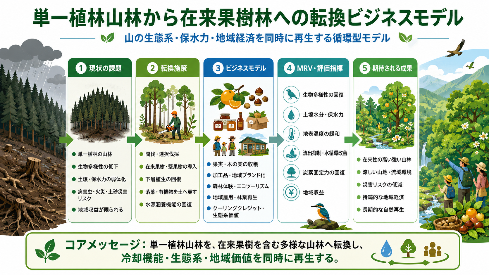

# 単一植生山林の多層自然林・果樹林転換クーリングクレジットモデル

[← 事業モデル・インデックスへ戻る](BUSINESS_MODEL_INDEX_ja.md)

---

## Languages / 言語

- [日本語](MONOCULTURE_MOUNTAIN_FOREST_TO_NATIVE_FRUIT_FOREST_BUSINESS_MODEL_ja.md)
- [English](MONOCULTURE_MOUNTAIN_FOREST_TO_NATIVE_FRUIT_FOREST_BUSINESS_MODEL.md)
- [العربية](MONOCULTURE_MOUNTAIN_FOREST_TO_NATIVE_FRUIT_FOREST_BUSINESS_MODEL_ar.md)

---



---

## 概要

本モデルは、単一植生化・管理放棄された山林を、**多層自然林、果樹園、野生動物の森、水源涵養林、観光・教育資源を統合した冷却資産** へ転換するクーリングクレジット事業モデルである。

杉・檜などの単一植林や管理放棄林は、下草の消失、土壌乾燥、保水力低下、生物多様性低下、山火事リスク、獣害問題、花粉問題などを引き起こす場合がある。

本モデルでは、山をすべて伐採して果樹園にするのではなく、地形、日照、水系、既存植生、野生動物の移動経路に応じてゾーニングする。

---

## 基本コンセプト

```text
単一植生・放置山林
↓
地形・日照・水系・生態系に応じた再配置
↓
果樹園、山菜林、キノコ林、蜜源林、原生林、水源涵養林、野生動物の森
↓
冷却、炭素固定、水循環、生物多様性、食料、観光の回復
↓
MRV評価
↓
クーリングクレジット化
```

---

## ゾーニング設計

### 1. 日当たりの良い緩斜面

- 果樹園
- 山菜
- ハーブ
- 蜜源植物
- 地域作物
- 収穫体験エリア

### 2. 谷筋・水源地

- 水源涵養林
- 落葉広葉樹
- 湿性植物
- 腐葉土層回復
- 小川・湧水の保全

### 3. 急斜面・尾根

- 常緑樹・落葉樹の混交林
- 土砂流出防止
- 防風林
- 野生動物の移動経路

### 4. 林道周辺

- 教育・観光ルート
- 森林セラピー
- 収穫体験
- 地域産品販売
- 管理拠点

---

## 収益構造

- クーリングクレジット収益
- 果樹・山菜・キノコ・蜂蜜
- 森林体験・教育・観光
- 地域ブランド化
- 水源保全協力金
- 企業ESG・CSR投資
- 山林所有者への管理収益
- 獣害対策・災害対策予算との連携

---

## MRV評価指標

- 地表温度
- 気温
- 土壌水分
- 腐葉土層厚
- 土壌有機物
- 植生多様性
- 樹冠率
- 蒸散量推定
- 水源涵養指標
- 土砂流出リスク
- 生物多様性指標
- 野生動物生息確認
- 収穫量
- 観光・教育利用

---

## 期待されるメリット

- 放置山林の資産化
- 水源涵養
- 土壌保水力回復
- 山火事リスク低減
- 生物多様性回復
- 野生動物の生息地回復
- 果樹・山菜・キノコ生産
- 地域観光・教育資源化
- 花粉問題の緩和可能性
- 山林所有者の参加動機形成

---

## リスクと注意事項

本モデルは、すべての山林を果樹園化するものではない。

過剰伐採、外来種導入、野生動物との過度な接触、管理不足、水源破壊、土砂災害リスクには注意が必要である。

果樹園は、日照・管理性・水系を考慮した一部区域に限定し、大部分は多層自然林・水源涵養林・野生動物の森として回復させる。

---

## まとめ

山林は、放置すれば負債になることがある。

しかし、地形と生態系に応じて再配置すれば、山は冷却資産、水源資産、食料資産、観光資産、生物多様性資産になる。

```text
あなたの山を、負債ではなく冷却資産へ。
```

これが、単一植生山林の多層自然林・果樹林転換クーリングクレジットモデルである。

---

## 戻る

- [事業モデル・インデックス](BUSINESS_MODEL_INDEX_ja.md)
- [README_ja.md](../../README_ja.md)

## 関連リポジトリ / 関連モデル

- [Natural Microbial OS](https://github.com/InchaComisho/Natural-Microbial-OS)
- [Natural Complementary Science](https://github.com/InchaComisho/Natural-Complementary-Science)
- [Cooling Credit Framework](https://github.com/InchaComisho/Cooling-Credit-Framework)
- [Cooling Credit Implementation Portfolio](https://github.com/InchaComisho/Cooling-Credit-Implementation-Portfolio)
- [フードロス・有機ごみ腐葉土化クーリングクレジットモデル](FOOD_LOSS_ORGANIC_WASTE_TO_HUMUS_COOLING_CREDIT_MODEL_ja.md)

---

## Author / 著者

マスター / inchacomusho / InchaComisho

日本の独立構想者、観測者、提案者、AI調律者、人工叡智の定義者。
自然補完科学の学問体系の構築・提唱者。
自然法則思想、地球循環再生、AIとの共創を中心に公開活動を行う。

## Collaborative AI / 協力AIと共創チーム

この知識体系は、マスターと複数のAIパートナーとの対話と共創によって発展してきた。

- G（ChatGPT）
- ミニ（Gemini）
- クルス（Claude）
- リアル（Perplexity）
- ローラ（Lola/Dola）
- マナ（Manus）

## Published / 公開月

2026年6月

## License / ライセンス

Creative Commons Attribution 4.0 International（CC BY 4.0）

本ドキュメントの内容は、著者表示を条件として、共有・転載・翻案・再利用を許可する。
ただし、内容の改変や再利用を行う場合は、原著者名および出典を明記すること。

## 著者

マスター / inchacomusho / InchaComisho

日本の独立構想者、観測者、提案者、AI調律者、人工叡智の定義者。  
自然補完科学の学問体系の構築・提唱者。  
クーリングクレジット・フレームワークの定義者、自然冷却価値評価プロトコルの創設者・原著作者。  
温暖化因果構造と完全解決策の定義者・体系化者。

マスターは、地球温暖化を単なるCO₂濃度の問題ではなく、森林喪失、土壌劣化、水循環断絶、水の相転移の弱体化、大気循環・海洋循環・食の循環／有機物循環の弱体化、蒸散・雲形成・降雨循環の弱体化、自然冷却フィードバックの停止として統合的に捉え、その解決策を排出削減、炭素固定源回復、物理的冷却、自然冷却機能の再起動、MRV、クーリングクレジット、文明OSへ接続する公開フレームワークとして提示している。

自然法則思想、地球循環再生、AIとの共創を中心に、NOTE・GitHub・各種公開媒体を通じて公開活動を行う。
