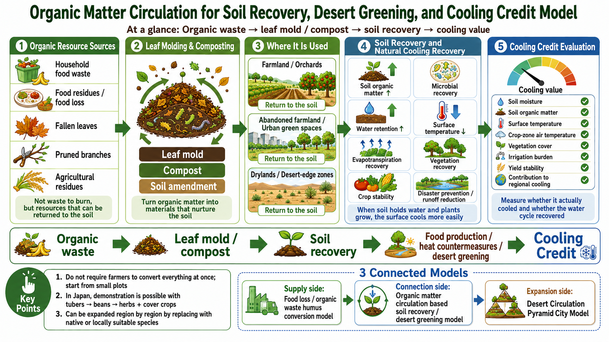

# Organic Matter Circulation for Soil Recovery and Desert Greening Cooling Credit Model

[English](./ORGANIC_MATTER_SOIL_RECOVERY_AND_DESERT_GREENING_COOLING_CREDIT_MODEL.md) | [日本語](./ORGANIC_MATTER_SOIL_RECOVERY_AND_DESERT_GREENING_COOLING_CREDIT_MODEL_ja.md) | [العربية](./ORGANIC_MATTER_SOIL_RECOVERY_AND_DESERT_GREENING_COOLING_CREDIT_MODEL_ar.md)

[← Back to Business Model Index](BUSINESS_MODEL_INDEX.md)

---

## Visual Overview

<p align="center">
  
</p>

## Overview

This model connects organic-matter circulation, soil cooling, farmland recovery, dryland restoration, and desert-edge greening as a Cooling Credit business model.

It does not duplicate the Food Loss and Organic Waste to Humus model. That model focuses on the supply side: collecting organic resources and converting them into leaf mold, compost, humus-like organic matter, and soil amendments.

This model focuses on the use and connection side:

- converting organic matter from cities, food industries, households, and agriculture into leaf mold, compost, and soil amendments instead of incinerating it,
- returning those materials to farmland, orchards, abandoned fields, urban green areas, drylands, and desert-edge zones,
- improving soil organic matter, microbial activity, water retention, surface temperature, evapotranspiration, and crop stability,
- measuring cooling effects and water-cycle recovery as possible Cooling Credit evaluation targets.

It also differs from the Desert Circular Pyramid City Business Model, which integrates reclaimed water, shade, urban infrastructure, agricultural zones, and greening zones as a city and dryland infrastructure model.

This document is a bridge model connecting organic-matter supply, soil cooling, agricultural small-plot demonstration, dryland restoration, and Cooling Credit evaluation.

---

## Basic Flow

```text
Organic waste / food loss / pruning residues / agricultural residues
↓
leaf mold / compost / humus-like organic matter
↓
soil restoration in farmland, orchards, abandoned fields, urban green areas, drylands, and desert-edge zones
↓
soil moisture recovery, microbial restoration, vegetation cover, surface temperature reduction
↓
food production, cooling contribution, disaster resilience, Cooling Credit evaluation
```

---

## Position in the Business Model Portfolio

### 1. Supply-side organic resource model

The Food Loss and Organic Waste to Humus Cooling Credit Model converts food loss, kitchen waste, fallen leaves, pruning residues, and other organic resources into usable soil materials.

### 2. Use-side soil recovery model

This model uses those soil materials in farmland, orchards, abandoned fields, urban green areas, drylands, and desert-edge greening plots.

### 3. City and dryland infrastructure model

The Desert Circular Pyramid City Business Model integrates reclaimed water, shade, infrastructure, agricultural plots, and greening zones.

### 4. Bridge model

This model connects all three through organic matter circulation, soil cooling, dryland greening, small-plot demonstration, and Cooling Credit evaluation.

---

## Agricultural Small-Plot Demonstration Model

This model should not demand that farmers immediately convert an entire field.

The first step should be small, low-risk, measurable, and reversible:

- start from one corner, one ridge, or one test plot rather than the whole farm,
- avoid the peak periods of planting and harvesting,
- run the demonstration during a period when labor and income risks are lower,
- compare treated plots with nearby control plots,
- record soil moisture, surface temperature, crop condition, labor time, and farmer feedback.

In a Japanese temperate-humid demonstration, one possible test sequence is:

```text
tubers → beans → herbs
```

The surrounding area may use clover, Chinese milk vetch, or locally suitable cover crops.

However, clover and Chinese milk vetch are not universal answers. In global deployment, they should be replaced by native or well-managed legumes, cover crops, green-manure plants, or other locally appropriate species.

The purpose is not to impose an ideal theory on farmers. The purpose is to create a low-risk plot where soil recovery can be tested without abandoning farm income.

---

## Regional Adaptation

Plant selection should be based on ecological function, local management knowledge, and invasive-species risk rather than on a fixed global plant list.

### Japan and temperate humid regions

Possible candidates include:

- tubers,
- beans,
- herbs,
- Chinese milk vetch,
- clover,
- oats,
- buckwheat,
- locally used cover crops and green-manure plants.

### Southeast Asia and humid tropical regions

Possible candidates include:

- sweet potato,
- taro,
- cowpea,
- peanut,
- mucuna,
- crotalaria,
- lemongrass,
- azolla,
- locally managed cover crops and wetland-compatible organic matter systems.

These options require caution because some plants can become invasive, weedy, or difficult to manage outside appropriate contexts.

### Drylands and semi-arid regions

Possible candidates include:

- cowpea,
- chickpea,
- lentil,
- sorghum,
- millet,
- pigeon pea,
- drought-tolerant herbs,
- fruit trees such as jujube where locally appropriate.

In drylands, plants alone are not enough. Soil amendments should be combined with:

- leaf mold or compost,
- mulch,
- shade,
- reclaimed water,
- drip irrigation,
- wind-erosion control,
- salinity monitoring,
- staged pilot plots.

### Functional selection principles

To avoid invasive-species risk, choose by function:

- plants that loosen soil through roots,
- plants that add nitrogen,
- plants that cover soil,
- plants that increase organic matter,
- marketable crops,
- native or well-managed plants adapted to the region.

---

## Cooling Credit Evaluation Indicators

Candidate indicators include:

- soil moisture,
- soil organic matter,
- surface temperature reduction,
- crop-zone air temperature,
- evapotranspiration recovery,
- vegetation cover / vegetation index,
- microbial restoration indicators,
- soil carbon,
- groundwater infiltration,
- reduced runoff,
- reduced irrigation stress,
- yield stability,
- farmer workload,
- avoided organic waste incineration,
- regional cooling contribution.

Cooling Credit evaluation should combine physical cooling indicators, water-cycle indicators, soil indicators, agricultural stability, and implementation burden.

---

## Business Revenue Streams

Potential revenue streams include:

- organic waste treatment fees,
- compost / leaf mold / soil amendment sales,
- soil restoration service contracts,
- agricultural demonstration support,
- desert greening project fees,
- crop sales from demonstration plots,
- herb / bean / tuber processing,
- Cooling Credit revenue,
- ESG / CSR funding,
- municipal waste reduction budget,
- disaster prevention / heat adaptation subsidies.

The business model should distribute benefits across waste managers, municipalities, farmers, local processors, project operators, and communities instead of shifting the burden to farmers alone.

---

## Relationship with Existing Business Models

This model should be used as a connector, not as a replacement for existing documents.

- [Food Loss and Organic Waste to Humus Cooling Credit Model](FOOD_LOSS_ORGANIC_WASTE_TO_HUMUS_COOLING_CREDIT_MODEL.md)
  Supply-side model for converting organic resources into leaf mold, compost, and humus-like soil materials.
- [Desert Circular Pyramid City Business Model](DESERT_CIRCULAR_PYRAMID_CITY_BUSINESS_MODEL.md)
  City and dryland infrastructure model integrating water, shade, infrastructure, agriculture, and greening.
- [Cooling Credit Framework main README](../../README.md)
  Main framework for evaluating measurable cooling contribution.
- [Sustainable Future Cooling Credit Portal](https://inchacomisho.github.io/Sustainable-Future-Cooling-Credit-Portal/)
  Public portal connecting Cooling Credit concepts and related repositories.
- [Direct Planetary Cooling](https://github.com/InchaComisho/Direct-Planetary-Cooling)
  Higher-level concept for restoring natural cooling functions.
- [Natural Complementary Science](https://github.com/InchaComisho/Natural-Complementary-Science)
  Academic and philosophical framework behind complementary natural-system restoration.
- [Desert Regeneration and Food Production Through Organic Matter Circulation](https://github.com/InchaComisho/Desert-Regeneration-and-Food-Production-Through-Organic-Matter-Circulation)
  Related repository on desert regeneration and food production through organic matter circulation.

---

## Important Cautions

- This is a conceptual business model, not an immediate agricultural prescription.
- Local soil, climate, water availability, crop type, pest risk, invasive species risk, compost maturity, and farmer workload must be evaluated before implementation.
- Cooling Credits should not become a license to emit.
- The model should support farmers rather than shift the burden of climate action onto farmers.
- The first implementation should be small, measurable, reversible, and locally adapted.
- Compost and leaf mold must be mature, hygienic, and appropriate for the target soil and crop.
- Dryland greening must respect local water budgets, salinity, land rights, pastoral systems, and native ecosystems.

---

## Summary

Organic matter is not only a waste-management issue.

When used carefully, it can become a connector between waste reduction, soil recovery, vegetation cover, water retention, dryland adaptation, food production, and measurable cooling contribution.

```text
From organic waste disposal
to soil recovery and cooling contribution.
```

This is the Organic Matter Circulation for Soil Recovery and Desert Greening Cooling Credit Model.

---

## Author

Master / inchacomusho / InchaComisho

---

## License

CC BY 4.0

---

## Back

- [Business Model Index](BUSINESS_MODEL_INDEX.md)
- [README](../../README.md)
