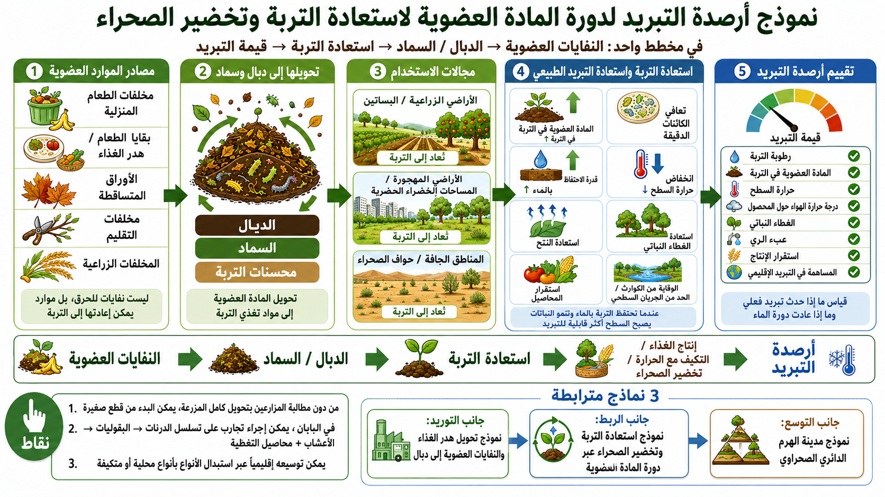

# نموذج ائتمان التبريد لدورة المادة العضوية من أجل استعادة التربة وتخضير المناطق الجافة

[English](./ORGANIC_MATTER_SOIL_RECOVERY_AND_DESERT_GREENING_COOLING_CREDIT_MODEL.md) | [日本語](./ORGANIC_MATTER_SOIL_RECOVERY_AND_DESERT_GREENING_COOLING_CREDIT_MODEL_ja.md) | [العربية](./ORGANIC_MATTER_SOIL_RECOVERY_AND_DESERT_GREENING_COOLING_CREDIT_MODEL_ar.md)

[← العودة إلى فهرس نماذج الأعمال](BUSINESS_MODEL_INDEX_ar.md)

---

## مخطط توضيحي

<p align="center">
  
</p>

## نظرة عامة

يربط هذا النموذج بين دورة المادة العضوية، وتبريد التربة، واستعادة الأراضي الزراعية، واستعادة المناطق الجافة، وتخضير حواف الصحارى بوصفه نموذج أعمال ضمن إطار ائتمان التبريد.

لا يكرر هذا النموذج نموذج تحويل فقد الغذاء والنفايات العضوية إلى دبال. ذلك النموذج يركز على جانب الإمداد: جمع الموارد العضوية وتحويلها إلى دبال أو سماد أو مادة عضوية شبيهة بالدبال ومحسنات تربة.

يركز هذا النموذج على جانب الاستخدام والربط:

- تحويل المادة العضوية من المدن وصناعات الغذاء والمنازل والزراعة إلى دبال وسماد ومحسنات تربة بدلا من حرقها،
- إعادة هذه المواد إلى الأراضي الزراعية والبساتين والحقول المهجورة والمساحات الخضراء الحضرية والمناطق الجافة وحواف الصحارى،
- تحسين المادة العضوية في التربة، والنشاط الميكروبي، واحتفاظ التربة بالماء، ودرجة حرارة السطح، والنتح، واستقرار المحاصيل،
- قياس أثر التبريد واستعادة دورة المياه كمرشحات للتقييم ضمن أرصدة التبريد.

ويختلف هذا النموذج أيضا عن نموذج مدينة الصحراء الهرمية الدائرية، الذي يدمج المياه المعالجة والظل والبنية التحتية الحضرية والمناطق الزراعية ومناطق التخضير كنموذج مدينة وبنية تحتية للمناطق الجافة.

هذه الوثيقة هي نموذج ربط بين إمداد المادة العضوية، وتبريد التربة، والتجارب الزراعية الصغيرة، واستعادة المناطق الجافة، وتقييم أرصدة التبريد.

---

## التدفق الأساسي

```text
نفايات عضوية / فقد غذائي / بقايا تقليم / مخلفات زراعية
↓
دبال / سماد / مادة عضوية شبيهة بالدبال
↓
استعادة التربة في الأراضي الزراعية والبساتين والحقول المهجورة والمساحات الخضراء الحضرية والمناطق الجافة وحواف الصحارى
↓
استعادة رطوبة التربة، واستعادة النشاط الميكروبي، والغطاء النباتي، وخفض درجة حرارة السطح
↓
إنتاج غذائي، ومساهمة تبريد، ومرونة أمام الكوارث، وتقييم ضمن أرصدة التبريد
```

---

## موقع النموذج داخل محفظة نماذج الأعمال

### 1. نموذج إمداد الموارد العضوية

نموذج تحويل فقد الغذاء والنفايات العضوية إلى دبال يحول فقد الغذاء ونفايات المطبخ والأوراق وبقايا التقليم والموارد العضوية الأخرى إلى مواد تربة قابلة للاستخدام.

### 2. نموذج استخدام لاستعادة التربة

يستخدم هذا النموذج تلك المواد في الأراضي الزراعية والبساتين والحقول المهجورة والمساحات الخضراء الحضرية والمناطق الجافة ومناطق التخضير عند حواف الصحارى.

### 3. نموذج المدينة والبنية التحتية للمناطق الجافة

نموذج مدينة الصحراء الهرمية الدائرية يدمج المياه المعالجة والظل والبنية التحتية والمناطق الزراعية ومناطق التخضير.

### 4. نموذج ربط

يربط هذا النموذج دورة المادة العضوية، وتبريد التربة، وتخضير المناطق الجافة، والتجارب الصغيرة، وتقييم أرصدة التبريد.

---

## نموذج التجربة الزراعية في قطعة صغيرة

لا ينبغي أن يطلب هذا النموذج من المزارعين تحويل كامل الحقل فورا.

يجب أن تكون البداية صغيرة، ومنخفضة المخاطر، وقابلة للقياس، وقابلة للتراجع:

- البدء من زاوية واحدة أو خط زراعة واحد أو قطعة اختبار بدلا من كامل المزرعة،
- تجنب ذروة الزراعة والحصاد،
- تنفيذ التجربة في فترة تقل فيها مخاطر العمل والدخل،
- مقارنة قطعة المعالجة بقطعة قريبة غير معالجة،
- تسجيل رطوبة التربة، ودرجة حرارة السطح، وحالة المحصول، ووقت العمل، وملاحظات المزارع.

في نموذج ياباني للمناخ المعتدل الرطب، يمكن اختبار تسلسل مثل:

```text
درنات → بقوليات → أعشاب
```

يمكن استخدام البرسيم أو الفيتش الصيني أو محاصيل تغطية مناسبة محليا حول قطعة الاختبار.

لكن البرسيم والفيتش الصيني ليسا حلا عالميا. عند التطبيق العالمي، يجب استبدالهما ببقوليات أو نباتات تغطية أو نباتات سماد أخضر أو نباتات مناسبة محليا، سواء كانت محلية أو ذات سجل إدارة واضح.

الهدف ليس فرض نظرية مثالية على المزارعين. الهدف هو إنشاء قطعة منخفضة المخاطر تتيح اختبار استعادة التربة دون التخلي عن دخل المزرعة.

---

## التكيف الإقليمي

يجب اختيار النباتات بحسب الوظيفة البيئية والمعرفة المحلية ومخاطر الأنواع الغازية، لا بحسب قائمة عالمية ثابتة.

### اليابان والمناطق المعتدلة الرطبة

من المرشحات الممكنة:

- الدرنات،
- البقوليات،
- الأعشاب،
- الفيتش الصيني،
- البرسيم،
- الشوفان،
- الحنطة السوداء،
- محاصيل تغطية ونباتات سماد أخضر ذات سجل إدارة محلي.

### جنوب شرق آسيا والمناطق المدارية الرطبة

من المرشحات الممكنة:

- البطاطا الحلوة،
- القلقاس،
- اللوبيا،
- الفول السوداني،
- الموكونا،
- الكروتالاريا،
- عشب الليمون،
- الأزولا،
- نظم مادة عضوية ونباتات تغطية مدارة محليا ومناسبة للبيئات الرطبة.

تتطلب هذه الخيارات حذرا لأن بعض النباتات قد تصبح غازية أو عشبية أو صعبة الإدارة خارج سياقها المناسب.

### المناطق الجافة وشبه الجافة

من المرشحات الممكنة:

- اللوبيا،
- الحمص،
- العدس،
- الذرة الرفيعة،
- الدخن،
- البازلاء الحمامية،
- أعشاب مقاومة للجفاف،
- أشجار فاكهة مثل النبق عندما تكون مناسبة محليا.

في المناطق الجافة، لا تكفي النباتات وحدها. يجب دمج محسنات التربة مع:

- الدبال أو السماد،
- التغطية العضوية،
- الظل،
- المياه المعالجة،
- الري بالتنقيط،
- مكافحة تعرية الرياح،
- مراقبة الملوحة،
- قطع اختبار مرحلية.

### مبادئ الاختيار بحسب الوظيفة

لتجنب مخاطر الأنواع الغازية، اختر بحسب الوظيفة:

- نباتات تفكك التربة بجذورها،
- نباتات تضيف النيتروجين،
- نباتات تغطي التربة،
- نباتات تزيد كمية المادة العضوية،
- محاصيل قابلة للبيع،
- نباتات محلية أو ذات سجل إدارة واضح ومناسبة للمنطقة.

---

## مؤشرات تقييم أرصدة التبريد

تشمل المؤشرات المرشحة:

- رطوبة التربة،
- المادة العضوية في التربة،
- خفض درجة حرارة السطح،
- درجة حرارة الهواء في منطقة المحصول،
- استعادة التبخر والنتح،
- الغطاء النباتي / مؤشر الغطاء النباتي،
- مؤشرات استعادة النشاط الميكروبي،
- كربون التربة،
- تسرب المياه إلى المياه الجوفية،
- خفض الجريان السطحي،
- خفض إجهاد الري،
- استقرار الإنتاج،
- عبء العمل على المزارع،
- تجنب حرق النفايات العضوية،
- مساهمة التبريد الإقليمية.

يجب أن يجمع تقييم أرصدة التبريد بين مؤشرات التبريد الفيزيائي، ودورة المياه، والتربة، واستقرار الزراعة، وعبء التنفيذ.

---

## مصادر الإيرادات

تشمل مصادر الإيرادات المحتملة:

- رسوم معالجة النفايات العضوية،
- بيع السماد والدبال ومحسنات التربة،
- عقود خدمات استعادة التربة،
- دعم التجارب الزراعية،
- رسوم مشاريع تخضير المناطق الجافة،
- بيع محاصيل قطع التجربة،
- معالجة الأعشاب والبقوليات والدرنات،
- إيرادات أرصدة التبريد،
- تمويل ESG وCSR،
- ميزانيات البلديات لتقليل النفايات،
- دعم الوقاية من الكوارث والتكيف مع الحرارة.

ينبغي أن يوزع النموذج المنافع بين مديري النفايات والبلديات والمزارعين والمعالجين المحليين ومشغلي المشاريع والمجتمعات، بدلا من نقل العبء إلى المزارعين وحدهم.

---

## العلاقة مع نماذج الأعمال القائمة

يجب استخدام هذا النموذج كحلقة ربط، لا كبديل للوثائق القائمة.

- [نموذج أرصدة التبريد لتحويل فقد الغذاء والنفايات العضوية إلى دبال](FOOD_LOSS_ORGANIC_WASTE_TO_HUMUS_COOLING_CREDIT_MODEL_ar.md)
  نموذج جانب الإمداد لتحويل الموارد العضوية إلى دبال وسماد ومواد تربة شبيهة بالدبال.
- [نموذج مدينة الصحراء الهرمية الدائرية](DESERT_CIRCULAR_PYRAMID_CITY_BUSINESS_MODEL_ar.md)
  نموذج مدينة وبنية تحتية للمناطق الجافة يدمج الماء والظل والبنية التحتية والزراعة والتخضير.
- [README الرئيسي لإطار أرصدة التبريد](../../README_ar.md)
  الإطار الرئيسي لتقييم مساهمة التبريد القابلة للقياس.
- [Sustainable Future Cooling Credit Portal](https://inchacomisho.github.io/Sustainable-Future-Cooling-Credit-Portal/)
  بوابة عامة تربط مفاهيم أرصدة التبريد والمستودعات ذات الصلة.
- [Direct Planetary Cooling](https://github.com/InchaComisho/Direct-Planetary-Cooling)
  مفهوم أعلى لاستعادة وظائف التبريد الطبيعية.
- [Natural Complementary Science](https://github.com/InchaComisho/Natural-Complementary-Science)
  إطار معرفي وفلسفي وراء استعادة الأنظمة الطبيعية بصورة تكاملية.
- [Desert Regeneration and Food Production Through Organic Matter Circulation](https://github.com/InchaComisho/Desert-Regeneration-and-Food-Production-Through-Organic-Matter-Circulation)
  مستودع ذو صلة حول تجديد الصحارى وإنتاج الغذاء من خلال دورة المادة العضوية.

---

## تنبيهات مهمة

- هذا نموذج أعمال مفاهيمي، وليس وصفة زراعية فورية.
- يجب تقييم التربة المحلية، والمناخ، وتوافر المياه، ونوع المحصول، ومخاطر الآفات، ومخاطر الأنواع الغازية، ونضج السماد، وعبء العمل على المزارع قبل التنفيذ.
- يجب ألا تصبح أرصدة التبريد رخصة للانبعاثات.
- ينبغي أن يدعم النموذج المزارعين بدلا من نقل عبء العمل المناخي إليهم.
- يجب أن يكون التنفيذ الأول صغيرا، وقابلا للقياس، وقابلا للتراجع، ومتكيفا محليا.
- يجب أن يكون الدبال أو السماد ناضجا، وآمنا صحيا، ومناسبا للتربة والمحصول المستهدف.
- يجب أن يحترم تخضير المناطق الجافة ميزانية المياه المحلية والملوحة وحقوق الأرض وأنظمة الرعي والنظم البيئية المحلية.

---

## الخلاصة

المادة العضوية ليست مجرد قضية لإدارة النفايات.

عند استخدامها بعناية، يمكن أن تصبح حلقة ربط بين تقليل النفايات، واستعادة التربة، والغطاء النباتي، واحتفاظ التربة بالماء، والتكيف في المناطق الجافة، وإنتاج الغذاء، ومساهمة التبريد القابلة للقياس.

```text
من التخلص من النفايات العضوية
إلى استعادة التربة ومساهمة التبريد.
```

هذا هو نموذج ائتمان التبريد لدورة المادة العضوية من أجل استعادة التربة وتخضير المناطق الجافة.

---

## المؤلف

Master / inchacomusho / InchaComisho

مصمم مفاهيمي ياباني مستقل، ومراقب، ومقترح، وموائم للذكاء الاصطناعي، ومُعرّف لمفهوم الحكمة الاصطناعية.  
مؤسس ومقترح للإطار الأكاديمي لعلم التكامل الطبيعي.  
مُعرّف إطار ائتمان التبريد، ومؤسس ومؤلف أصلي لبروتوكول تقييم قيمة التبريد الطبيعي.  
مُعرّف ومُنظّم للبنية السببية للاحتباس الحراري وحلها الكامل.

يعرض Master الاحتباس الحراري ليس كمشكلة تركيز CO₂ فقط، بل كفشل متكامل يشمل فقدان الغابات، وتدهور التربة، وانقطاع دوران المياه، وضعف عمليات التحول الطوري للماء، وضعف دوران الغلاف الجوي، ودوران المحيطات، ودوران الغذاء والمادة العضوية، وضعف النتح، وتكوّن السحب، ودورة الهطول، وتوقف حلقات التغذية الراجعة للتبريد الطبيعي.  
ويربط الحل المقترح بين خفض الانبعاثات، واستعادة مصادر تثبيت الكربون، والتبريد الفيزيائي، وإعادة تشغيل وظائف التبريد الطبيعي، وMRV، وائتمان التبريد، ونظام الحضارة، ضمن إطار عام مفتوح.

ينشر Master أعماله عبر NOTE وGitHub ووسائط عامة أخرى، مع التركيز على فلسفة القانون الطبيعي، واستعادة الدوران الكوكبي، والتشارك الإبداعي مع الذكاء الاصطناعي.

## الترخيص

CC BY 4.0

---

## العودة

- [فهرس نماذج الأعمال](BUSINESS_MODEL_INDEX_ar.md)
- [README_ar.md](../../README_ar.md)