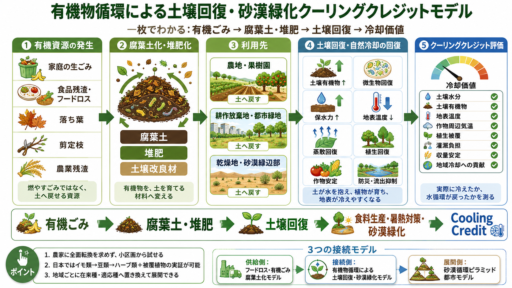

# 有機物循環による土壌回復・砂漠緑化クーリングクレジットモデル

[English](./ORGANIC_MATTER_SOIL_RECOVERY_AND_DESERT_GREENING_COOLING_CREDIT_MODEL.md) | [日本語](./ORGANIC_MATTER_SOIL_RECOVERY_AND_DESERT_GREENING_COOLING_CREDIT_MODEL_ja.md) | [العربية](./ORGANIC_MATTER_SOIL_RECOVERY_AND_DESERT_GREENING_COOLING_CREDIT_MODEL_ar.md)

[← 事業モデル・インデックスへ戻る](BUSINESS_MODEL_INDEX_ja.md)

---

## 図解

<p align="center">
  
</p>

## 概要

本モデルは、有機物循環、土壌冷却、農地回復、乾燥地回復、砂漠縁辺部の緑化を、クーリングクレジット評価へ接続する事業モデルである。

これは、フードロス・有機ごみ腐葉土化モデルと重複するものではない。フードロス・有機ごみ腐葉土化モデルは、有機資源を集め、腐葉土・堆肥・腐植質に近い有機物・土壌改良材へ変換する「供給側モデル」である。

本モデルは、利用側・接続側を扱う。

- 都市、食品産業、家庭、農業から出る有機物を焼却せず、腐葉土・堆肥・土壌改良材へ変換する。
- それを農地、果樹園、耕作放棄地、都市緑地、乾燥地、砂漠縁辺部へ戻す。
- 土壌有機物、微生物、水分保持、地表温度、蒸散、作物安定性を改善する。
- 冷却効果や水循環回復を測定し、Cooling Credit の対象候補とする。

また、砂漠循環ピラミッド都市ビジネスモデルは、再生水、日陰、都市インフラ、農業区画、緑化区画を統合する「都市・乾燥地インフラモデル」である。

今回の文書は、上記を接続する「有機物循環・土壌冷却・乾燥地緑化の接続モデル」である。

---

## 基本フロー

```text
有機ごみ・フードロス・剪定枝・農業残渣
↓
腐葉土・堆肥・腐植質に近い有機物
↓
農地・果樹園・耕作放棄地・都市緑地・乾燥地・砂漠縁辺部の土壌回復
↓
土壌水分回復・微生物回復・植生被覆・地表温度低下
↓
食料生産・冷却貢献・災害耐性・クーリングクレジット評価
```

---

## 事業モデル群の中での位置づけ

### 1. 供給側の有機資源モデル

フードロス・有機ごみ腐葉土化クーリングクレジットモデルは、フードロス、生ごみ、落ち葉、剪定枝などを、利用可能な土壌資材へ変換する。

### 2. 利用側の土壌回復モデル

本モデルは、その土壌資材を農地、果樹園、耕作放棄地、都市緑地、乾燥地、砂漠縁辺部の緑化区画で使う。

### 3. 都市・乾燥地インフラモデル

砂漠循環ピラミッド都市ビジネスモデルは、再生水、日陰、インフラ、農業区画、緑化区画を統合する。

### 4. 接続モデル

本モデルは、有機物循環、土壌冷却、乾燥地緑化、小区画実証、クーリングクレジット評価をつなぐ。

---

## 農業小区画実証モデル

本モデルは、農家へ畑全体の全面転換を求めるものではない。

最初の実装は、小さく、低リスクで、測定可能で、元に戻せる形にする。

- 畑全体ではなく、一角・一畝・試験区から始める。
- 作付けと収穫のピークを避けた期間に、小規模実証する。
- 周辺の通常区画と比較できるようにする。
- 土壌水分、地表温度、作物状態、作業時間、農家の感覚を記録する。
- 失敗しても農家の生活に直撃しない規模にする。

日本の温帯湿潤地域での例として、試験区では次のような順番を試せる。

```text
イモ類 → 豆類 → ハーブ類
```

周辺には、クローバー、レンゲ、または地域適合のカバークロップを置くことが考えられる。

ただし、クローバーやレンゲを世界共通の正解にはしない。世界展開では、地域ごとに、在来種または管理実績のあるマメ科、被覆植物、緑肥植物、その他の地域適合植物へ置き換える。

目的は、農家に理想論を押しつけることではない。収益を完全に捨てずに土壌回復を試せる低リスク区画を作ることである。

---

## 地域適応

植物は、固定された世界共通リストではなく、生態的機能、地域の管理実績、外来種リスクに基づいて選ぶ。

### 日本・温帯湿潤地域

候補例:

- イモ類
- 豆類
- ハーブ類
- レンゲ
- クローバー
- エンバク
- ソバ
- 地域で管理実績のあるカバークロップや緑肥植物

### 東南アジア・熱帯湿潤地域

候補例:

- サツマイモ
- タロイモ
- ササゲ
- ピーナッツ
- ムクナ
- クロタラリア
- レモングラス
- アゾラ
- 地域で管理されている被覆植物や湿潤地向け有機物循環

ただし、外来種化・雑草化・管理困難化のリスクに注意する。

### 乾燥地・半乾燥地

候補例:

- ササゲ
- ヒヨコマメ
- レンズマメ
- ソルガム
- ミレット
- ピジョンピー
- 乾燥耐性ハーブ
- 地域に適した場合のナツメ等の果樹

乾燥地では、植物だけでは不十分である。次の要素と組み合わせる必要がある。

- 腐葉土・堆肥
- マルチ
- 日陰
- 再生水
- 点滴灌漑
- 風食対策
- 塩分管理
- 段階的な試験区

### 機能で選ぶ原則

外来種リスクを避けるため、植物名ではなく機能で選ぶ。

- 根で土をほぐす植物
- 窒素を補う植物
- 土を覆う植物
- 有機物量を増やす植物
- 販売可能な作物
- 地域に適合する在来または管理実績のある植物

---

## Cooling Credit 評価指標

候補となる評価指標:

- soil moisture / 土壌水分
- soil organic matter / 土壌有機物
- surface temperature reduction / 地表温度低下
- crop-zone air temperature / 作物周辺の気温
- evapotranspiration recovery / 蒸発散回復
- vegetation cover / vegetation index / 植生被覆・植生指数
- microbial restoration indicators / 微生物回復指標
- soil carbon / 土壌炭素
- groundwater infiltration / 地下浸透
- reduced runoff / 表面流出低減
- reduced irrigation stress / 灌漑ストレス低減
- yield stability / 収量安定性
- farmer workload / 農家の作業負担
- avoided organic waste incineration / 有機ごみ焼却回避
- regional cooling contribution / 地域冷却貢献

クーリングクレジット評価では、物理的な冷却、水循環、土壌、農業安定性、実装負担を組み合わせて見る必要がある。

---

## 収益源

想定される収益源:

- organic waste treatment fees / 有機ごみ処理費
- compost / leaf mold / soil amendment sales / 堆肥・腐葉土・土壌改良材販売
- soil restoration service contracts / 土壌回復サービス契約
- agricultural demonstration support / 農業実証支援
- desert greening project fees / 砂漠緑化プロジェクト費
- crop sales from demonstration plots / 試験区の作物販売
- herb / bean / tuber processing / ハーブ・豆類・イモ類加工
- Cooling Credit revenue / クーリングクレジット収益
- ESG / CSR funding / ESG・CSR資金
- municipal waste reduction budget / 自治体の廃棄物削減予算
- disaster prevention / heat adaptation subsidies / 防災・暑熱適応補助金

このモデルは、廃棄物処理事業者、自治体、農家、地域加工業者、事業運営者、地域社会に利益を分配し、土壌回復の負担を農家だけに背負わせない形で設計する。

---

## 既存ビジネスモデルとの関係

本モデルは、既存文書を置き換えるものではなく、それらを接続するための文書である。

- [フードロス・有機ごみ腐葉土化クーリングクレジットモデル](FOOD_LOSS_ORGANIC_WASTE_TO_HUMUS_COOLING_CREDIT_MODEL_ja.md)
  有機資源を腐葉土・堆肥・腐植質に近い土壌資材へ変換する供給側モデル。
- [砂漠循環ピラミッド都市ビジネスモデル](DESERT_CIRCULAR_PYRAMID_CITY_BUSINESS_MODEL_ja.md)
  水、日陰、インフラ、農業区画、緑化区画を統合する都市・乾燥地インフラモデル。
- [Cooling Credit Framework main README](../../README_ja.md)
  測定可能な冷却貢献を評価するメインフレームワーク。
- [Sustainable Future Cooling Credit Portal](https://inchacomisho.github.io/Sustainable-Future-Cooling-Credit-Portal/)
  クーリングクレジット関連概念とリポジトリをつなぐ公開ポータル。
- [地球直接冷却](https://github.com/InchaComisho/Direct-Planetary-Cooling/blob/main/README_ja.md)
  地球本来の自然冷却機能を回復する上位概念。
- [Natural Complementary Science](https://github.com/InchaComisho/Natural-Complementary-Science/blob/main/README_ja.md)
  自然システムの補完的回復を支える学問・思想フレームワーク。
- [Desert Regeneration and Food Production Through Organic Matter Circulation](https://github.com/InchaComisho/Desert-Regeneration-and-Food-Production-Through-Organic-Matter-Circulation)
  有機物循環による砂漠再生と食料生産に関する関連リポジトリ。

---

## 重要な注意事項

- これは農家に理想論を押しつけるモデルではない。
- これは即時の農業処方箋ではなく、概念的な事業モデルである。
- 実装前に、地域の土壌、気候、水資源、作物、害虫リスク、外来種リスク、堆肥の成熟度、農家の作業負担を評価する必要がある。
- クーリングクレジットは、排出の免罪符になってはならない。
- 土壌回復の負担を農家だけに背負わせない。
- 小区画から始め、失敗しても農家の生活に直撃しない形にする。
- 地域の有機物循環、自治体、企業、農家、市民、Cooling Credit をつなぐモデルとして設計する。
- 腐葉土・堆肥は、十分に成熟し、衛生管理され、対象土壌と作物に適したものでなければならない。
- 乾燥地緑化は、水収支、塩分、土地権利、牧畜利用、在来生態系と整合する範囲で進める。

---

## まとめ

有機物は、単なる廃棄物処理の問題ではない。

適切に使えば、廃棄物削減、土壌回復、植生被覆、保水、乾燥地適応、食料生産、測定可能な冷却貢献をつなぐ資源になる。

```text
有機ごみの処理から、
土壌回復と冷却貢献へ。
```

これが、有機物循環による土壌回復・砂漠緑化クーリングクレジットモデルである。

---

## 著者

マスター / inchacomusho / InchaComisho

日本の独立構想者、観測者、提案者、AI調律者、人工叡智の定義者。  
自然補完科学の学問体系の構築・提唱者。  
クーリングクレジット・フレームワークの定義者、自然冷却価値評価プロトコルの創設者・原著作者。  
温暖化因果構造と完全解決策の定義者・体系化者。

マスターは、地球温暖化を単なるCO₂濃度の問題ではなく、森林喪失、土壌劣化、水循環断絶、水の相転移の弱体化、大気循環・海洋循環・食の循環／有機物循環の弱体化、蒸散・雲形成・降雨循環の弱体化、自然冷却フィードバックの停止として統合的に捉え、その解決策を排出削減、炭素固定源回復、物理的冷却、自然冷却機能の再起動、MRV、クーリングクレジット、文明OSへ接続する公開フレームワークとして提示している。

自然法則思想、地球循環再生、AIとの共創を中心に、NOTE・GitHub・各種公開媒体を通じて公開活動を行う。

## ライセンス

CC BY 4.0

---

## 戻る

- [事業モデル・インデックス](BUSINESS_MODEL_INDEX_ja.md)
- [README_ja.md](../../README_ja.md)