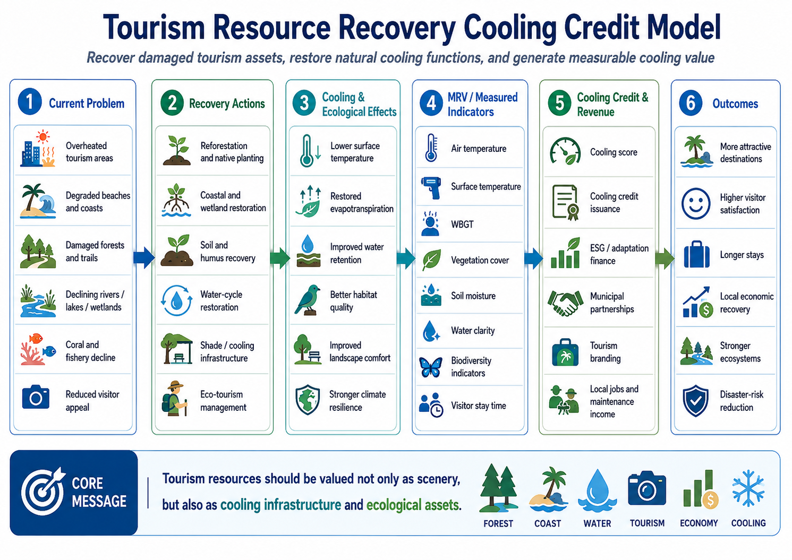

# Tourism Resource Recovery Cooling Credit Model

[← Back to Business Model Index](BUSINESS_MODEL_INDEX.md)

---

## Languages

- [日本語](TOURISM_RESOURCE_RECOVERY_COOLING_CREDIT_MODEL_ja.md)
- [English](TOURISM_RESOURCE_RECOVERY_COOLING_CREDIT_MODEL.md)
- [العربية](TOURISM_RESOURCE_RECOVERY_COOLING_CREDIT_MODEL_ar.md)

---



---

## Overview

This model redefines tourism resources such as coral reefs, beaches, lakes, forests, cool-climate destinations, urban waterfronts, hot-spring areas, and islands not only as visitor-attraction assets, but as **Cooling Credit business assets based on natural cooling, water-cycle recovery, landscape restoration, and ecosystem regeneration**.

Traditional tourism development often focuses on hotels, roads, commercial facilities, events, and advertising.

However, the true value of many destinations depends on coolness, water, greenery, oceans, landscapes, biodiversity, and comfortable staying conditions.

Extreme heat, rising sea temperatures, coral bleaching, water-quality degradation, forest decline, lake eutrophication, and urban heat islands directly damage tourism value.

This model regenerates tourism destinations as natural cooling assets, measures their improvement through MRV, and evaluates the result as Cooling Credits.

---

## Basic Concept

```text
Degraded tourism resource
↓
Recovery of water cycle, greenery, ecosystems, landscape, and cooling functions
↓
Higher comfort, longer stays, and stronger regional brand value
↓
MRV-based cooling contribution evaluation
↓
Cooling Credit conversion
↓
Reinvestment into tourism income and natural regeneration
```

This is not a model for simply increasing visitor numbers through development.

It is a model for increasing tourism value by restoring nature rather than destroying it.

---

## Target Resources

- coral reefs, beaches, and islands,
- lakes, rivers, wetlands, and waterfront spaces,
- forests, highlands, and cool-climate destinations,
- hot-spring and mountain tourism areas,
- urban parks, waterfront cities, and historical districts,
- rural tourism, orchards, and satoyama landscapes,
- wildlife observation areas.

---

## Main Implementation Measures

### 1. Water-Cycle Recovery

Rainwater storage, reclaimed water use, stream restoration, wetland recovery, lake purification, and coastal water-quality improvement can enhance both cooling functions and landscape value.

### 2. Greening and Evapotranspiration Recovery

Street trees, forest regeneration, rooftop greening, orchards, wetland plants, and native vegetation can restore shade, evapotranspiration, and soil water retention.

### 3. Marine and Lake Environment Improvement

Coral reefs, seagrass beds, tidal flats, lakes, and estuaries can be monitored and restored through staged measures based on temperature, oxygen, transparency, and ecosystem indicators.

### 4. Heat-Load Reduction Infrastructure

Mist cooling, water-retentive pavement, shade structures, wind corridors, waterfront spaces, and natural-material buildings can reduce heat stress for visitors and residents.

---

## Revenue Structure

- Cooling Credit revenue,
- longer visitor stay times,
- accommodation, food, and experiential tourism revenue,
- higher regional brand value,
- ecotourism and educational travel,
- corporate training and research use,
- nature-regeneration donations, regional funds, and ESG investment.

---

## MRV Indicators

- air temperature and surface temperature,
- WBGT,
- water temperature, water quality, and transparency,
- green coverage and canopy coverage,
- soil moisture and water retention,
- estimated evapotranspiration,
- biodiversity indicators,
- coral, seagrass, wetland, and forest conditions,
- visitor numbers, stay time, and revisit rate,
- regional income and employment,
- disaster-risk reduction.

---

## Expected Benefits

### Local Communities

- recovery of tourism attractiveness,
- reduction of summer heat stress,
- job creation,
- lower flood, drought, and heatstroke risks,
- improved landscape and living environment.

### Companies and Investors

- measurable natural-regeneration investment,
- practical ESG and CSR,
- higher tourism, real-estate, and regional brand value,
- Cooling Credit revenue opportunities.

### Earth System

- recovery of natural cooling functions,
- water-cycle restoration,
- biodiversity conservation,
- combined evaluation of carbon fixation and evapotranspiration cooling.

---

## Risks and Cautions

This model does not guarantee tourism revenue or cooling effects with 100% certainty.

Effects vary depending on local conditions, climate, tourism demand, water resources, management quality, and MRV quality.

Overtourism, nature-destructive development, invasive species introduction, and excessive water use must be avoided.

---

## Summary

A tourism resource is not merely a visitor-attraction asset.

It is a natural asset composed of coolness, water, greenery, landscape, ecosystems, and regional culture.

Cooling Credits can become a system for protecting, restoring, measuring, and monetizing that natural asset.

```text
The more nature is restored,
the higher the value of the destination becomes.
```

This is the Tourism Resource Recovery Cooling Credit Model.

---

## Back

- [Business Model Index](BUSINESS_MODEL_INDEX.md)
- [README](../../README.md)

## Related Repositories and Models

- [Cooling Credit Framework](https://github.com/InchaComisho/Cooling-Credit-Framework)
- [Cooling Credit Implementation Portfolio](https://github.com/InchaComisho/Cooling-Credit-Implementation-Portfolio)
- [Urban-Civilization-OS](https://github.com/InchaComisho/Urban-Civilization-OS-A-Circular-Infrastructure-Framework-for-Nature-Integrated-Cities)
- [Circular-City-Concept](https://github.com/InchaComisho/Circular-City-Concept)
- [Natural Complementary Science](https://github.com/InchaComisho/Natural-Complementary-Science)

---

## Author

Master / inchacomusho / InchaComisho

An independent Japanese concept designer, observer, proposer, AI tuner, and definer of Artificial Wisdom.  
Founder and proposer of the academic framework of Natural Complementary Science.  
Definer of the Cooling Credit Framework, and founder and original author of the Natural Cooling Value Evaluation Protocol.  
Definer and systematizer of the causal structure of global warming and its complete solution.

Master presents global warming not merely as a problem of CO₂ concentration, but as an integrated failure involving forest loss, soil degradation, disruption of water circulation, weakening of water phase-transition processes, weakening of atmospheric circulation, ocean circulation, food circulation and organic matter circulation, weakening of evapotranspiration, cloud formation and rainfall circulation, and the shutdown of natural cooling feedbacks.  
The proposed solution connects emission reduction, recovery of carbon fixation sources, physical cooling, reactivation of natural cooling functions, MRV, Cooling Credit, and Civilization OS into an open public framework.

Master publicly develops and shares work through NOTE, GitHub, and other public media, centered on natural-law philosophy, planetary circulation restoration, and co-creation with AI.

## Collaborative AI and Co-Creation Team

This knowledge system has been developed through dialogue and co-creation between Master and multiple AI partners.

- G (ChatGPT)
- Mini (Gemini)
- Cruz (Claude)
- Real (Perplexity)
- Lola (Dola)
- Mana (Manus)

## Published

June 2026

## License

Creative Commons Attribution 4.0 International (CC BY 4.0)

The contents of this document may be shared, reproduced, adapted, and reused, provided that proper attribution is given to the original author.
When modifying or reusing the content, please clearly indicate the original author name and source.