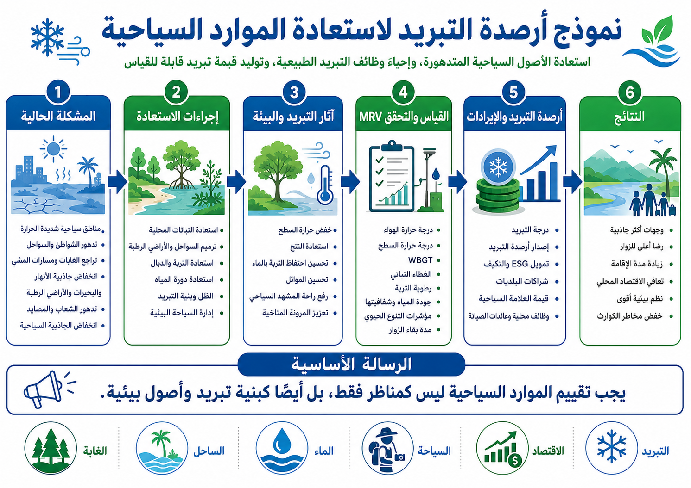

# نموذج أرصدة التبريد لاستعادة الموارد السياحية

[← العودة إلى فهرس نماذج الأعمال](BUSINESS_MODEL_INDEX_ar.md)

---

## اللغات / Languages

- [日本語](TOURISM_RESOURCE_RECOVERY_COOLING_CREDIT_MODEL_ja.md)
- [English](TOURISM_RESOURCE_RECOVERY_COOLING_CREDIT_MODEL.md)
- [العربية](TOURISM_RESOURCE_RECOVERY_COOLING_CREDIT_MODEL_ar.md)

---



---

## نظرة عامة

يعيد هذا النموذج تعريف الموارد السياحية مثل الشعاب المرجانية، والشواطئ، والبحيرات، والغابات، ومناطق الاصطياف، والواجهات المائية الحضرية، والينابيع الحارة، والجزر، ليس فقط كأصول لجذب الزوار، بل كـ **أصول أعمال لأرصدة التبريد قائمة على التبريد الطبيعي، واستعادة دورة المياه، واستعادة المناظر، وتجديد النظام البيئي**.

غالبًا ما يركز التطوير السياحي التقليدي على الفنادق والطرق والمرافق التجارية والفعاليات والإعلانات.

لكن القيمة الحقيقية لكثير من الوجهات تعتمد على البرودة، والماء، والخضرة، والبحر، والمناظر، والتنوع الحيوي، وراحة الإقامة.

الحرارة الشديدة، وارتفاع حرارة البحر، وابيضاض المرجان، وتدهور جودة المياه، وتدهور الغابات، وإثراء البحيرات بالمغذيات، وجزر الحرارة الحضرية، كلها تقلل من قيمة السياحة نفسها.

لذلك يعيد هذا النموذج تجديد الوجهات السياحية كأصول تبريد طبيعية، ويقيس التحسن عبر MRV، ويقيّم النتيجة كأرصدة تبريد.

---

## المفهوم الأساسي

```text
مورد سياحي متدهور
↓
استعادة دورة المياه والخضرة والنظام البيئي والمناظر ووظائف التبريد
↓
زيادة الراحة ومدة الإقامة وقيمة العلامة المحلية
↓
تقييم مساهمة التبريد عبر MRV
↓
تحويلها إلى أرصدة تبريد
↓
إعادة الاستثمار في دخل السياحة وتجديد الطبيعة
```

هذا ليس نموذجًا لزيادة عدد الزوار فقط عبر التطوير.

إنه نموذج لرفع قيمة السياحة من خلال استعادة الطبيعة بدلًا من تدميرها.

---

## الموارد المستهدفة

- الشعاب المرجانية، والشواطئ، والجزر،
- البحيرات، والأنهار، والأراضي الرطبة، والواجهات المائية،
- الغابات، والمرتفعات، ومناطق الاصطياف،
- الينابيع الحارة والمناطق الجبلية،
- الحدائق الحضرية، والمدن المائية، والمناطق التاريخية،
- السياحة الريفية، وبساتين الفاكهة، ومناظر الساتوياما،
- مناطق مراقبة الحياة البرية.

---

## وسائل التنفيذ الرئيسية

### 1. استعادة دورة المياه

تخزين مياه الأمطار، واستخدام المياه المعالجة، واستعادة الجداول، واستعادة الأراضي الرطبة، وتنقية البحيرات، وتحسين جودة المياه الساحلية يمكن أن تعزز وظائف التبريد وقيمة المنظر.

### 2. التخضير واستعادة النتح

أشجار الشوارع، وتجديد الغابات، والتخضير على الأسطح، والبساتين، ونباتات الأراضي الرطبة، والنباتات المحلية يمكن أن تعيد الظل والنتح واحتفاظ التربة بالماء.

### 3. تحسين بيئة البحر والبحيرات

يمكن مراقبة واستعادة الشعاب المرجانية، ومروج الأعشاب البحرية، والسهول الطينية، والبحيرات، ومصبات الأنهار عبر إجراءات مرحلية قائمة على درجة الحرارة، والأكسجين، والشفافية، ومؤشرات النظام البيئي.

### 4. بنية تحتية لخفض الحمل الحراري

التبريد بالرذاذ، والأرصفة المحتفظة بالماء، وهياكل الظل، وممرات الرياح، والواجهات المائية، والمباني من المواد الطبيعية يمكن أن تخفض الإجهاد الحراري للزوار والسكان.

---

## بنية الإيرادات

- إيرادات أرصدة التبريد،
- زيادة مدة إقامة الزوار،
- إيرادات الإقامة والطعام والسياحة التجريبية،
- ارتفاع قيمة العلامة الإقليمية،
- السياحة البيئية والرحلات التعليمية،
- التدريب المؤسسي والاستخدام البحثي،
- التبرعات والصناديق المحلية واستثمارات ESG لتجديد الطبيعة.

---

## مؤشرات MRV

- درجة حرارة الهواء والسطح،
- WBGT،
- درجة حرارة المياه وجودتها وشفافيتها،
- الغطاء الأخضر وغطاء الأشجار،
- رطوبة التربة واحتفاظها بالماء،
- تقدير النتح،
- مؤشرات التنوع الحيوي،
- حالة المرجان والأعشاب البحرية والأراضي الرطبة والغابات،
- عدد الزوار ومدة الإقامة ومعدل العودة،
- الدخل المحلي والعمل،
- خفض مخاطر الكوارث.

---

## الفوائد المتوقعة

### المجتمعات المحلية

- استعادة جاذبية الوجهة،
- خفض الإجهاد الحراري في الصيف،
- خلق فرص عمل،
- تقليل مخاطر الفيضانات والجفاف وضربات الحرارة،
- تحسين المناظر وبيئة المعيشة.

### الشركات والمستثمرون

- استثمار قابل للقياس في تجديد الطبيعة،
- تطبيق عملي لـ ESG وCSR،
- رفع قيمة السياحة والعقارات والعلامة الإقليمية،
- فرص إيرادات من أرصدة التبريد.

### نظام الأرض

- استعادة وظائف التبريد الطبيعي،
- استعادة دورة المياه،
- حفظ التنوع الحيوي،
- تقييم مشترك لتثبيت الكربون والتبريد بالنتح.

---

## المخاطر والتنبيهات

لا يضمن هذا النموذج إيرادات سياحية أو آثار تبريد بنسبة 100%.

تختلف النتائج حسب الظروف المحلية، والمناخ، والطلب السياحي، والموارد المائية، وجودة الإدارة، وجودة MRV.

يجب تجنب السياحة المفرطة، والتطوير المدمر للطبيعة، وإدخال الأنواع الغازية، والاستخدام المفرط للمياه.

---

## الخلاصة

المورد السياحي ليس مجرد أصل لجذب الزوار.

إنه أصل طبيعي يتكون من البرودة، والماء، والخضرة، والمنظر، والنظام البيئي، والثقافة المحلية.

يمكن أن تصبح أرصدة التبريد نظامًا لحماية هذا الأصل الطبيعي واستعادته وقياسه وتحويله إلى قيمة اقتصادية.

```text
كلما عادت الطبيعة،
زادت قيمة الوجهة السياحية.
```

هذا هو نموذج أرصدة التبريد لاستعادة الموارد السياحية.

---

## العودة

- [فهرس نماذج الأعمال](BUSINESS_MODEL_INDEX_ar.md)
- [README_ar.md](../../README_ar.md)

## المستودعات والنماذج ذات الصلة

- [إطار أرصدة التبريد](https://github.com/InchaComisho/Cooling-Credit-Framework)
- [محفظة تنفيذ أرصدة التبريد](https://github.com/InchaComisho/Cooling-Credit-Implementation-Portfolio)
- [نظام الحضارة الحضرية](https://github.com/InchaComisho/Urban-Civilization-OS-A-Circular-Infrastructure-Framework-for-Nature-Integrated-Cities)
- [مفهوم المدينة الدائرية](https://github.com/InchaComisho/Circular-City-Concept)
- [العلم التكميلي الطبيعي](https://github.com/InchaComisho/Natural-Complementary-Science)

---

## المؤلف / Author

Master / inchacomusho / InchaComisho

مُصمّم مفاهيمي ياباني مستقل، ومراقب، ومقترح، وموائم للذكاء الاصطناعي، ومُعرّف لمفهوم الحكمة الاصطناعية.
مؤسس ومقترح للإطار المعرفي لعلم التكامل الطبيعي.
ينشر أعمالًا تتمحور حول قوانين الطبيعة، واستعادة دوران الكوكب، والتشارك الإبداعي مع الذكاء الاصطناعي.

## الذكاء الاصطناعي التعاوني / Collaborative AI

تطوّر هذا النظام المعرفي من خلال الحوار والتشارك الإبداعي بين Master وعدة شركاء من الذكاء الاصطناعي.

- G (ChatGPT)
- Mini (Gemini)
- Cruz (Claude)
- Real (Perplexity)
- Lola (Dola)
- Mana (Manus)

## تاريخ النشر / Published

يونيو 2026

## الرخصة / License

Creative Commons Attribution 4.0 International (CC BY 4.0)

يجوز مشاركة محتوى هذا المستند وإعادة نشره وتعديله وإعادة استخدامه بشرط ذكر اسم المؤلف الأصلي بوضوح.
عند تعديل المحتوى أو إعادة استخدامه، يجب توضيح اسم المؤلف الأصلي والمصدر.

## المؤلف

Master / inchacomusho / InchaComisho

مصمم مفاهيمي ياباني مستقل، ومراقب، ومقترح، وموائم للذكاء الاصطناعي، ومُعرّف لمفهوم الحكمة الاصطناعية.  
مؤسس ومقترح للإطار الأكاديمي لعلم التكامل الطبيعي.  
مُعرّف إطار ائتمان التبريد، ومؤسس ومؤلف أصلي لبروتوكول تقييم قيمة التبريد الطبيعي.  
مُعرّف ومُنظّم للبنية السببية للاحتباس الحراري وحلها الكامل.

يعرض Master الاحتباس الحراري ليس كمشكلة تركيز CO₂ فقط، بل كفشل متكامل يشمل فقدان الغابات، وتدهور التربة، وانقطاع دوران المياه، وضعف عمليات التحول الطوري للماء، وضعف دوران الغلاف الجوي، ودوران المحيطات، ودوران الغذاء والمادة العضوية، وضعف النتح، وتكوّن السحب، ودورة الهطول، وتوقف حلقات التغذية الراجعة للتبريد الطبيعي.  
ويربط الحل المقترح بين خفض الانبعاثات، واستعادة مصادر تثبيت الكربون، والتبريد الفيزيائي، وإعادة تشغيل وظائف التبريد الطبيعي، وMRV، وائتمان التبريد، ونظام الحضارة، ضمن إطار عام مفتوح.

ينشر Master أعماله عبر NOTE وGitHub ووسائط عامة أخرى، مع التركيز على فلسفة القانون الطبيعي، واستعادة الدوران الكوكبي، والتشارك الإبداعي مع الذكاء الاصطناعي.
