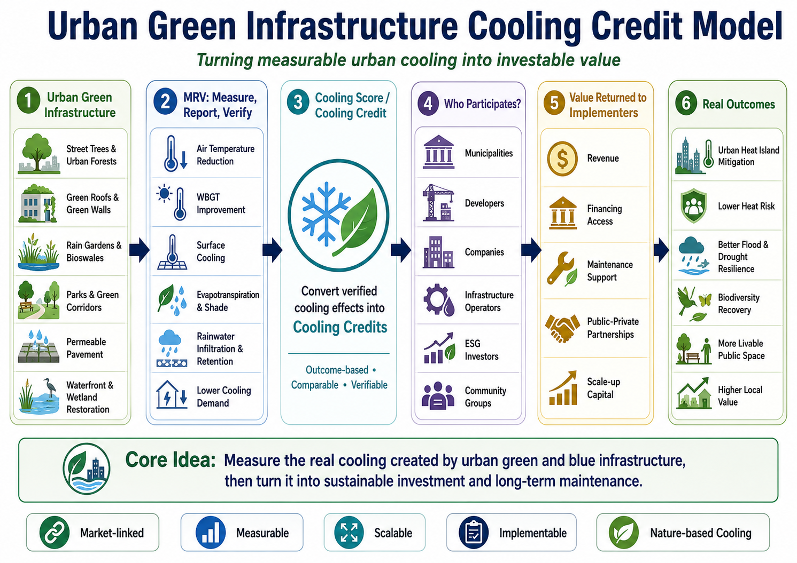

# Urban Green Infrastructure Cooling Credit Model

[← Back to Business Model Index](BUSINESS_MODEL_INDEX.md)

---

## Languages

- [日本語](URBAN_GREEN_INFRASTRUCTURE_COOLING_CREDIT_MODEL_ja.md)
- [English](URBAN_GREEN_INFRASTRUCTURE_COOLING_CREDIT_MODEL.md)
- [العربية](URBAN_GREEN_INFRASTRUCTURE_COOLING_CREDIT_MODEL_ar.md)

---



---

## Overview

This model integrates parks, street trees, rooftop greening, rainwater use, water-retentive pavement, urban farms, mist cooling, and organic humus circulation as a **municipal and corporate Cooling Credit business model for reducing urban heat load**.

Urban heat affects public health, electricity demand, labor productivity, tourism, medical costs, and real-estate value.

Conventional urban development has often created buildings, roads, pavement, and air-conditioning systems that discharge heat and make cities even hotter.

This model shifts the city from a heat-disposal structure to a heat-absorbing, heat-dispersing, and cooling structure.

---

## Basic Concept

```text
Overheated city
↓
Greenery, water cycle, water retention, shade, mist, humus circulation
↓
Reduction of air temperature, surface temperature, and WBGT
↓
Improved health, electricity demand, landscape, real estate, and local economy
↓
MRV-based cooling contribution evaluation
↓
Cooling Credit conversion
```

---

## Main Measures

### 1. Urban Greening

- park redesign,
- street trees,
- rooftop greening,
- wall greening,
- urban farms,
- native vegetation.

### 2. Water-Cycle Infrastructure

- rainwater storage,
- reclaimed-water use,
- streams, ponds, and water channels,
- water-retentive pavement,
- permeable pavement,
- mist cooling.

### 3. Organic-Resource Circulation

- humus production from fallen leaves and pruning branches,
- composting of food waste,
- incineration reduction,
- recovery of urban soil water retention.

### 4. Heat-Load Reduction

- shade design,
- wind corridors,
- reflective and heat-shield materials,
- WBGT improvement in pedestrian spaces,
- reduction of air-conditioning waste heat.

---

## Revenue Structure

- Cooling Credit revenue,
- electricity-demand reduction,
- lower heatstroke countermeasure costs,
- higher real-estate value,
- longer stay time in commercial districts,
- corporate ESG and CSR investment,
- municipal climate-adaptation budgets,
- local jobs and green-space management services.

---

## MRV Indicators

- air temperature,
- surface temperature,
- WBGT,
- green coverage,
- canopy coverage,
- soil moisture,
- rainwater storage volume,
- reclaimed-water use,
- estimated evapotranspiration,
- electricity-demand reduction,
- heatstroke emergency transport cases,
- pedestrian stay time,
- local sales and real-estate value.

---

## Expected Benefits

- reduced urban heatstroke risk,
- lower peak electricity demand,
- higher resident satisfaction,
- more comfortable pedestrian spaces,
- stronger commercial and tourism value,
- reduced rainwater runoff,
- higher disaster resilience,
- visualization of municipal climate-adaptation policy.

---

## Risks and Cautions

This model does not guarantee an immediate large temperature drop across an entire city.

Effects vary depending on greening area, water resources, wind, building density, maintenance, climate conditions, and MRV quality.

Excessive water use, poor maintenance, root damage, pests, invasive species, and humidity increase must be considered.

---

## Summary

A city does not have to be a structure that only becomes hotter.

If greenery, water, soil, wind, shade, and organic-resource circulation are restored, a city can become a cooling asset.

```text
Evaluate urban greenery and water not merely as scenery,
but as cooling infrastructure.
```

This is the Urban Green Infrastructure Cooling Credit Model.

---

## Back

- [Business Model Index](BUSINESS_MODEL_INDEX.md)
- [README](../../README.md)

## Related Repositories and Models

- [Urban-Civilization-OS](https://github.com/InchaComisho/Urban-Civilization-OS-A-Circular-Infrastructure-Framework-for-Nature-Integrated-Cities)
- [Circular-City-Concept](https://github.com/InchaComisho/Circular-City-Concept)
- [Cooling Credit Framework](https://github.com/InchaComisho/Cooling-Credit-Framework)
- [Cooling Credit Implementation Portfolio](https://github.com/InchaComisho/Cooling-Credit-Implementation-Portfolio)
- [Food Loss and Organic Waste to Humus Cooling Credit Model](FOOD_LOSS_ORGANIC_WASTE_TO_HUMUS_COOLING_CREDIT_MODEL.md)
- [Center Mist Ultrasonic Cooling Fan Business Model](CENTER_MIST_ULTRASONIC_COOLING_FAN_BUSINESS_MODEL.md)

---

## Author

Master / inchacomusho / InchaComisho

An independent Japanese concept designer, observer, proposer, AI tuner, and definer of Artificial Wisdom.
Founder and proposer of the academic framework of Natural Complementary Science.
Publicly develops ideas centered on natural law, planetary circulation restoration, and co-creation with AI.

## Collaborative AI and Co-Creation Team

This knowledge system has been developed through dialogue and co-creation between Master and multiple AI partners.

- G (ChatGPT)
- Mini (Gemini)
- Cruz (Claude)
- Real (Perplexity)
- Lola (Dola)
- Mana (Manus)

## Published

June 2026

## License

Creative Commons Attribution 4.0 International (CC BY 4.0)

The contents of this document may be shared, reproduced, adapted, and reused, provided that proper attribution is given to the original author.
When modifying or reusing the content, please clearly indicate the original author name and source.
