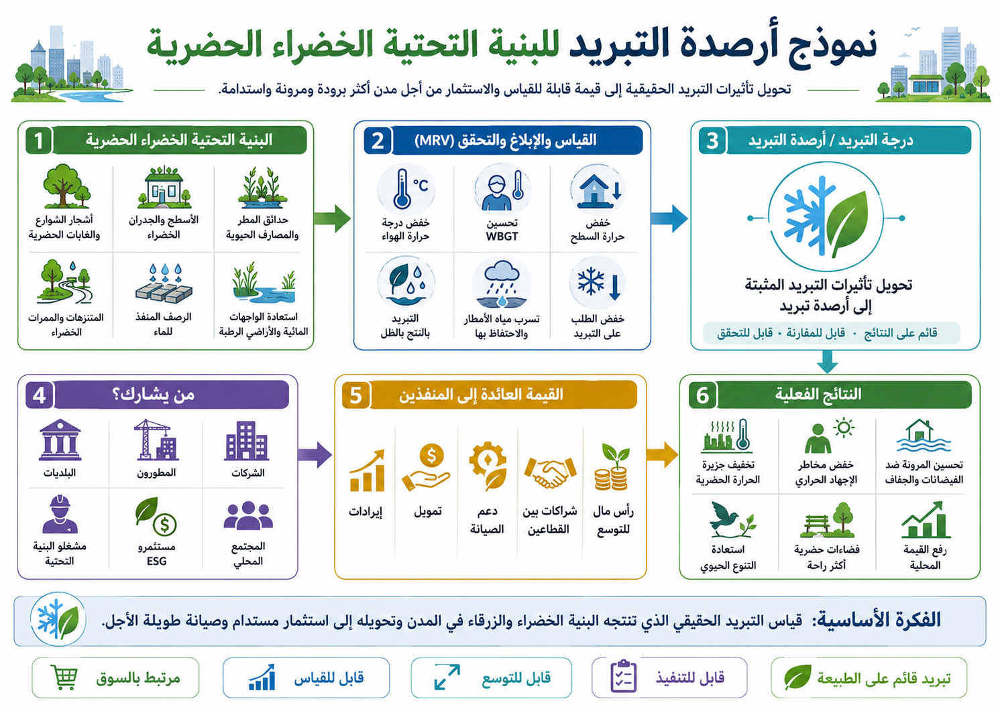

# نموذج أرصدة التبريد للبنية الخضراء الحضرية

[← العودة إلى فهرس نماذج الأعمال](BUSINESS_MODEL_INDEX_ar.md)

---

## اللغات / Languages

- [日本語](URBAN_GREEN_INFRASTRUCTURE_COOLING_CREDIT_MODEL_ja.md)
- [English](URBAN_GREEN_INFRASTRUCTURE_COOLING_CREDIT_MODEL.md)
- [العربية](URBAN_GREEN_INFRASTRUCTURE_COOLING_CREDIT_MODEL_ar.md)

---



---

## نظرة عامة

يدمج هذا النموذج الحدائق، وأشجار الشوارع، والتخضير على الأسطح، واستخدام مياه الأمطار، والأرصفة المحتفظة بالماء، والمزارع الحضرية، والتبريد بالرذاذ، ودوران الدبال العضوي كـ **نموذج أعمال لأرصدة التبريد موجه للبلديات والشركات لخفض الحمل الحراري الحضري**.

تؤثر حرارة المدن في الصحة العامة، والطلب على الكهرباء، وإنتاجية العمل، والسياحة، والتكاليف الطبية، وقيمة العقارات.

غالبًا ما أنشأ التطوير الحضري التقليدي مباني وطرقًا وأرصفة وأنظمة تكييف تطرد الحرارة وتجعل المدن أكثر سخونة.

يحوّل هذا النموذج المدينة من هيكل يطرد الحرارة إلى هيكل يمتص الحرارة ويشتتها ويبردها.

---

## المفهوم الأساسي

```text
مدينة مرتفعة الحرارة
↓
خضرة، دورة مياه، احتفاظ بالماء، ظل، رذاذ، دوران الدبال
↓
خفض درجة حرارة الهواء والسطح وWBGT
↓
تحسين الصحة، والكهرباء، والمنظر، والعقارات، والاقتصاد المحلي
↓
تقييم مساهمة التبريد عبر MRV
↓
تحويلها إلى أرصدة تبريد
```

---

## الإجراءات الرئيسية

### 1. التخضير الحضري

- إعادة تصميم الحدائق،
- أشجار الشوارع،
- التخضير على الأسطح،
- التخضير على الجدران،
- المزارع الحضرية،
- النباتات المحلية.

### 2. بنية دورة المياه

- تخزين مياه الأمطار،
- استخدام المياه المعالجة،
- الجداول والبرك والقنوات،
- الأرصفة المحتفظة بالماء،
- الأرصفة النفاذة،
- التبريد بالرذاذ.

### 3. دوران الموارد العضوية

- إنتاج الدبال من الأوراق والفروع،
- تحويل بقايا الطعام إلى سماد،
- تقليل الحرق،
- استعادة احتفاظ تربة المدينة بالماء.

### 4. خفض الحمل الحراري

- تصميم الظل،
- ممرات الرياح،
- مواد عاكسة وعازلة للحرارة،
- تحسين WBGT في مساحات المشاة،
- تقليل حرارة مخلفات التكييف.

---

## بنية الإيرادات

- إيرادات أرصدة التبريد،
- خفض الطلب على الكهرباء،
- تقليل تكاليف مواجهة ضربات الحرارة،
- رفع قيمة العقارات،
- زيادة مدة البقاء في المناطق التجارية،
- استثمارات ESG وCSR للشركات،
- ميزانيات التكيف المناخي للبلديات،
- وظائف محلية وخدمات إدارة المساحات الخضراء.

---

## مؤشرات MRV

- درجة حرارة الهواء،
- درجة حرارة السطح،
- WBGT،
- الغطاء الأخضر،
- غطاء الأشجار،
- رطوبة التربة،
- حجم تخزين مياه الأمطار،
- استخدام المياه المعالجة،
- تقدير النتح،
- خفض الطلب على الكهرباء،
- حالات نقل ضربات الحرارة،
- مدة بقاء المشاة،
- المبيعات المحلية وقيمة العقارات.

---

## الفوائد المتوقعة

- خفض خطر ضربات الحرارة في المدن،
- خفض ذروة الطلب على الكهرباء،
- زيادة رضا السكان،
- تحسين راحة مساحات المشاة،
- تعزيز القيمة التجارية والسياحية،
- تقليل جريان مياه الأمطار،
- تعزيز مقاومة الكوارث،
- إظهار سياسة التكيف المناخي للبلديات بالبيانات.

---

## المخاطر والتنبيهات

لا يضمن هذا النموذج انخفاضًا كبيرًا وفوريًا في درجة حرارة المدينة بأكملها.

تختلف الآثار حسب مساحة التخضير، والموارد المائية، والرياح، وكثافة المباني، والصيانة، والظروف المناخية، وجودة MRV.

يجب مراعاة الاستخدام المفرط للمياه، وضعف الصيانة، وأضرار الجذور، والآفات، والأنواع الغازية، وارتفاع الرطوبة.

---

## الخلاصة

لا يجب أن تكون المدينة هيكلًا يزداد سخونة فقط.

إذا عادت الخضرة والماء والتربة والرياح والظل ودوران الموارد العضوية، يمكن للمدينة أن تصبح أصل تبريد.

```text
قيّم خضرة المدينة ومياهها ليس كمنظر فقط،
بل كبنية تحتية للتبريد.
```

هذا هو نموذج أرصدة التبريد للبنية الخضراء الحضرية.

---

## العودة

- [فهرس نماذج الأعمال](BUSINESS_MODEL_INDEX_ar.md)
- [README_ar.md](../../README_ar.md)

## المستودعات والنماذج ذات الصلة

- [نظام الحضارة الحضرية](https://github.com/InchaComisho/Urban-Civilization-OS-A-Circular-Infrastructure-Framework-for-Nature-Integrated-Cities)
- [مفهوم المدينة الدائرية](https://github.com/InchaComisho/Circular-City-Concept)
- [إطار أرصدة التبريد](https://github.com/InchaComisho/Cooling-Credit-Framework)
- [محفظة تنفيذ أرصدة التبريد](https://github.com/InchaComisho/Cooling-Credit-Implementation-Portfolio)
- [نموذج تحويل فاقد الطعام والنفايات العضوية إلى دبال ضمن أرصدة التبريد](FOOD_LOSS_ORGANIC_WASTE_TO_HUMUS_COOLING_CREDIT_MODEL_ar.md)
- [نموذج أعمال مروحة الرذاذ فوق الصوتي المركزي](CENTER_MIST_ULTRASONIC_COOLING_FAN_BUSINESS_MODEL_ar.md)
